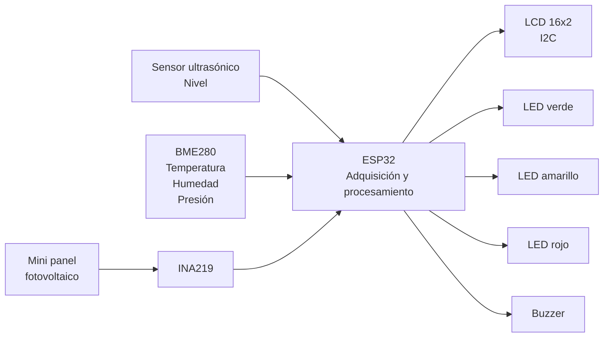
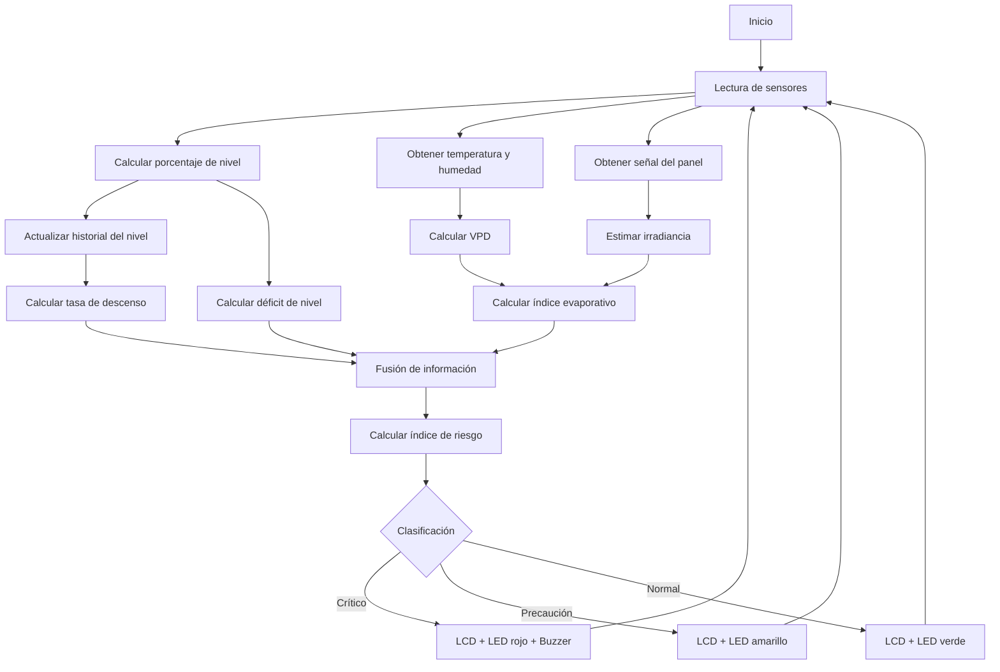

[⬅ Volver al índice](00-Home.md)

# 2. Solución propuesta

## 2.1 Descripción general
**WREWS (Water Risk Early Warning System)** es un prototipo funcional de bajo costo diseñado para monitorear la disponibilidad de agua y generar alertas tempranas de riesgo hídrico.

El sistema utiliza un **ESP32** como unidad central de adquisición y procesamiento. A partir de diferentes sensores se analizan tres dimensiones principales:

1. **Disponibilidad actual de agua**, mediante el nivel.
2. **Condiciones ambientales favorables a la evaporación**, mediante temperatura, humedad e irradiancia estimada.
3. **Tendencia del nivel**, mediante su tasa de descenso.

Estas variables son procesadas y fusionadas localmente para clasificar la situación en tres estados:

- 🟢 **NORMAL**
- 🟡 **PRECAUCIÓN**
- 🔴 **CRÍTICO**

La notificación se realiza de forma completamente local mediante una **pantalla LCD 16×2 I²C**, LEDs de estado y un buzzer.

---

## 2.2 Restricciones y decisiones de diseño

| Tipo | Restricción / necesidad | Decisión de diseño |
|---|---|---|
| **Técnica** | El sistema debe monitorear la disponibilidad de agua | Se utiliza un sensor ultrasónico OKY3261/HC-SR04 para medir la distancia hasta la superficie y convertirla en porcentaje de nivel |
| **Técnica** | Deben considerarse variables ambientales | Se utiliza un BME280 para adquirir temperatura, humedad relativa y presión atmosférica |
| **Técnica** | Se requiere considerar la radiación solar | Se utiliza un mini panel fotovoltaico junto con un INA219 para obtener una señal relacionada con la irradiancia recibida |
| **Técnica** | Se requiere notificación *in situ* sin redes de comunicación | Toda la actuación es local mediante LCD 16×2 I²C, LEDs verde/amarillo/rojo y buzzer |
| **Técnica** | Los sensores utilizan diferentes interfaces | BME280, INA219 y LCD utilizan el bus I²C; el sensor ultrasónico utiliza GPIO digital para TRIG y ECHO |
| **Técnica** | El sistema debe detectar cambios en el comportamiento del nivel | Se comparan mediciones sucesivas para estimar la tasa de descenso |
| **Técnica** | Una condición crítica no debe quedar oculta por un promedio | Además del índice ponderado se utilizan reglas de seguridad independientes |
| **Económica** | El prototipo debe ser de bajo costo | Se seleccionaron componentes comerciales, accesibles y reutilizables |
| **Operativa** | El usuario debe interpretar fácilmente el estado | Se utilizan tres estados y una codificación semafórica: verde, amarillo y rojo |
| **Operativa** | El sistema debe funcionar sin infraestructura externa | Todo el procesamiento se ejecuta localmente en el ESP32 |

---

## 2.3 Variables monitoreadas

WREWS adquiere o calcula las siguientes variables:

| Variable | Fuente | Uso |
|---|---|---|
| Distancia | Sensor ultrasónico | Medición base para determinar el nivel |
| Nivel (%) | Calculado | Representa la disponibilidad actual de agua |
| Temperatura | BME280 | Cálculo de condiciones ambientales |
| Humedad relativa | BME280 | Cálculo de condiciones ambientales |
| Presión atmosférica | BME280 | Variable ambiental de contexto |
| Señal del panel | Panel + INA219 | Estimación de irradiancia |
| Irradiancia estimada | Calculada | Evaluación de condiciones favorables a la evaporación |
| VPD | Calculado | Representa la demanda evaporativa de la atmósfera |
| Índice evaporativo | Calculado | Resume las condiciones favorables a la evaporación |
| Tasa de descenso | Calculada | Representa la tendencia del nivel |
| Índice de riesgo | Calculado | Fusión de disponibilidad, ambiente y tendencia |
| Estado | Calculado | NORMAL, PRECAUCIÓN o CRÍTICO |

---

## 2.4 Arquitectura general



El **ESP32** constituye el núcleo del sistema.

Los sensores proporcionan la información de entrada, el microcontrolador realiza los cálculos y finalmente controla los dispositivos de salida según el riesgo detectado.

---

## 2.5 Flujo de procesamiento

El funcionamiento general de WREWS sigue el siguiente flujo:



---

## 2.6 Medición del nivel

El sensor ultrasónico se instala sobre el punto de almacenamiento y mide la distancia hasta la superficie.

La relación general es:

```text
Distancia pequeña
        ↓
Nivel alto

Distancia grande
        ↓
Nivel bajo
```

El porcentaje de nivel se obtiene mediante una calibración basada en las posiciones correspondientes a lleno y vacío.

De forma general:

```text
Nivel (%) =
100 × (Distancia_vacío - Distancia_medida)
      -------------------------------------
      (Distancia_vacío - Distancia_lleno)
```

El resultado se limita al rango:

```text
0 % ≤ Nivel ≤ 100 %
```

En la implementación física, los valores de calibración corresponden a las dimensiones reales de la maqueta.

Para las pruebas se utiliza una **plataforma móvil que representa la superficie del agua**. Al modificar su altura se pueden reproducir diferentes niveles de manera controlada.

---

## 2.7 Condiciones ambientales

### Temperatura, humedad y presión

El BME280 proporciona:

```text
Temperatura
Humedad relativa
Presión atmosférica
```

La temperatura y la humedad se utilizan para calcular el **VPD — Vapor Pressure Deficit**.

Conceptualmente:

```text
TEMPERATURA ──┐
              ├──→ VPD
HUMEDAD ──────┘
```

Un VPD mayor representa condiciones atmosféricas más favorables para la pérdida de agua por evaporación.

La presión atmosférica se conserva como una variable ambiental complementaria.

Debido a que su variación esperada en un punto fijo es relativamente pequeña, no participa directamente como disparador principal del riesgo.

---

## 2.8 Estimación de irradiancia

La radiación solar se representa mediante un mini panel fotovoltaico.

La cadena de adquisición es:

```text
RADIACIÓN
    ↓
PANEL FOTOVOLTAICO
    ↓
INA219
    ↓
SEÑAL ELÉCTRICA
    ↓
IRRADIANCIA ESTIMADA
```

Cuando aumenta la energía luminosa recibida por el panel, cambia su respuesta eléctrica.

El INA219 permite adquirir esta señal para que el ESP32 pueda utilizarla dentro del procesamiento.

La irradiancia obtenida debe interpretarse como una **estimación experimental**.

El panel fotovoltaico no sustituye un piranómetro calibrado, por lo que una medición metrológica precisa en W/m² requeriría una calibración frente a un instrumento de referencia.

---

## 2.9 Índice de condiciones favorables a la evaporación

WREWS combina el VPD con la irradiancia estimada.

Conceptualmente:

```text
TEMPERATURA ─┐
             ├──→ VPD ───────────┐
HUMEDAD ─────┘                    │
                                  ├──→ ÍNDICE EVAPORATIVO
PANEL → INA219 → IRRADIANCIA ─────┘
```

El resultado representa qué tan favorables son las condiciones ambientales para la evaporación.

Es importante señalar que:

> **El índice evaporativo no representa el porcentaje de agua que se ha evaporado.**

Representa un indicador relativo de las **condiciones ambientales que favorecen la evaporación**.

---

## 2.10 Tasa de descenso

Una medición instantánea del nivel no permite determinar cómo está evolucionando el almacenamiento.

Por esta razón, WREWS compara mediciones tomadas en diferentes momentos.

Conceptualmente:

```text
Nivel anterior - Nivel actual
-----------------------------
       Tiempo transcurrido
```

Esto permite estimar la **tasa de descenso del nivel**.

Por ejemplo:

```text
Reservorio A
Nivel = 50 %
Tasa ≈ 0
→ relativamente estable

Reservorio B
Nivel = 50 %
Tasa de descenso alta
→ disponibilidad disminuyendo rápidamente
```

De esta forma, la tendencia aporta información adicional a la disponibilidad instantánea.

---

## 2.11 Fusión de información

La lógica principal combina tres componentes:

```text
                 WREWS

       DISPONIBILIDAD ACTUAL
          Déficit de nivel
                50 %
                 │
                 │
CONDICIONES ─────┼───── TENDENCIA
AMBIENTALES      │      DEL NIVEL
VPD +            │      Tasa de
irradiancia      │      descenso
30 %             │      20 %
                 │
                 ▼
          ÍNDICE DE RIESGO
                 │
                 ▼
       NORMAL / PRECAUCIÓN /
              CRÍTICO
```

La ponderación utilizada es:

```text
Riesgo =
0.50 × Déficit de nivel
+
0.30 × Índice evaporativo
+
0.20 × Tendencia
```

La mayor ponderación corresponde al nivel porque la **disponibilidad actual de agua constituye la variable principal del problema**.

Las condiciones ambientales permiten anticipar escenarios favorables a una mayor pérdida de agua y la tendencia permite identificar reducciones aceleradas.

---

## 2.12 Reglas de seguridad

El índice ponderado no constituye el único mecanismo de decisión.

WREWS incorpora reglas de seguridad para condiciones individuales extremas.

Esto evita una situación como:

```text
Nivel extremadamente bajo
+
Ambiente favorable
+
Tasa estable
```

en la que el promedio matemático pudiera reducir artificialmente la percepción del riesgo.

Por tanto:

```text
ÍNDICE PONDERADO
       +
REGLAS DE SEGURIDAD
       ↓
ESTADO FINAL
```

---

## 2.13 Estados del sistema

### 🟢 NORMAL

Representa condiciones en las que la disponibilidad de agua y los demás indicadores no muestran un riesgo significativo.

Respuesta local:

```text
LCD → NORMAL
LED verde → activo
Buzzer → apagado
```

### 🟡 PRECAUCIÓN

Indica que una o varias variables han alcanzado condiciones que justifican atención.

Respuesta local:

```text
LCD → PRECAUCIÓN
LED amarillo → activo
Buzzer → sin alarma crítica
```

### 🔴 CRÍTICO

Representa una situación de riesgo elevado o una condición individual considerada crítica.

Respuesta local:

```text
LCD → CRÍTICO
LED rojo → activo
Buzzer → alarma sonora
```

---

## 2.14 Visualización local

La implementación física utiliza una **LCD 16×2 I²C**.

Debido al espacio disponible en la pantalla, la información se organiza para presentar las variables más relevantes y el estado del sistema sin interferir con el procesamiento interno.

Los LEDs permiten interpretar rápidamente la clasificación:

```text
🟢 Verde     → NORMAL
🟡 Amarillo  → PRECAUCIÓN
🔴 Rojo      → CRÍTICO
```

El buzzer añade una señal sonora cuando se identifica una condición crítica.

---

## 2.15 Funcionamiento sin redes de comunicación

Una característica importante del diseño es que la generación de la alerta no depende de infraestructura externa.

Todo ocurre dentro del dispositivo:

```text
SENSORES
   ↓
ESP32
   ↓
PROCESAMIENTO
   ↓
DECISIÓN
   ↓
LCD + LEDs + BUZZER
```

No se requiere:

- Wi-Fi;
- Bluetooth;
- LoRa;
- GSM;
- servicios en la nube;
- conexión a Internet.

Esto permite que el sistema continúe generando alertas locales incluso en un lugar sin conectividad.

---

## 2.16 Simulación e implementación física

El desarrollo se realizó en dos etapas.

### Simulación

Wokwi permitió:

- diseñar la arquitectura;
- probar sensores;
- desarrollar *custom chips*;
- comprobar el bus I²C;
- probar escenarios controlados;
- verificar la lógica de riesgo;
- depurar el firmware.

La simulación original utiliza algunos componentes virtuales diferentes a los finalmente disponibles para el montaje físico.

### Implementación física

Posteriormente se integraron los componentes reales y se ajustó el sistema a las características de la maqueta.

La pantalla utilizada en el prototipo físico final es una **LCD 16×2 I²C**, seleccionada por disponibilidad y porque permite cumplir el requisito de visualización local.

Por tanto, la simulación debe entenderse como una etapa de desarrollo y validación previa, mientras que la implementación física representa la versión final presentada en el Challenge.

---

[⬅ Anterior: Resumen y motivación](01-Resumen-Motivacion.md) · [⬆ Índice](00-Home.md) · [Siguiente: Desarrollo modular ➡](03-Desarrollo-Modular.md)