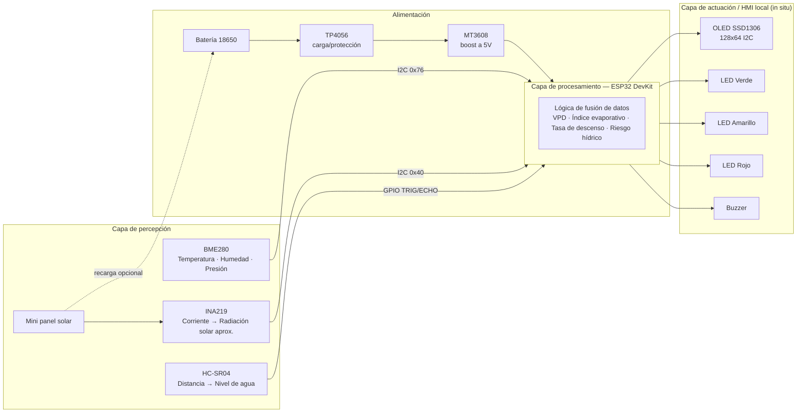
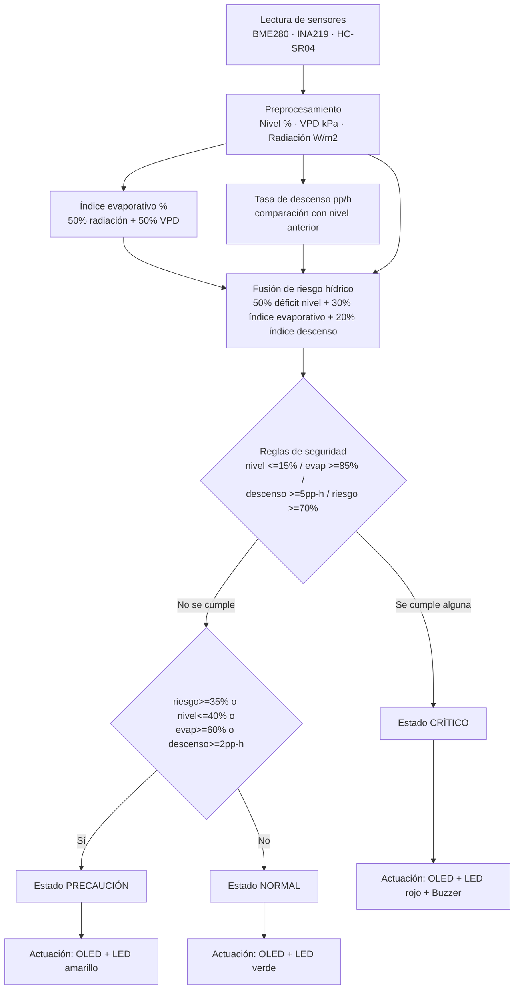

[⬅ Volver al índice](00-Home.md)

# 2. Solución propuesta

## 2.1 Restricciones de diseño identificadas

| Tipo | Restricción | Cómo se abordó |
|---|---|---|
| **Técnica** | No usar Raspberry Pi; usar un microcontrolador embebido (ESP32, Arduino, Intel Galileo) | Se seleccionó **ESP32 DevKit-C** por su doble núcleo, memoria suficiente para lógica de fusión, bus I²C nativo y bajo costo/disponibilidad. |
| **Técnica** | Notificación *in situ*: alarma física y visualización en tiempo real **sin** redes ni tecnologías físicas de comunicación | Toda la actuación es local: pantalla **OLED SSD1306**, **LEDs** verde/amarillo/rojo y **buzzer** piezoeléctrico. No se usa Wi-Fi, Bluetooth, LoRa, GSM ni ningún enlace externo; toda la lógica de decisión corre embebida en el ESP32. |
| **Técnica** | Los sensores manejan distintos niveles lógicos y protocolos | BME280, INA219 y OLED comparten bus **I²C** (3.3 V); el HC-SR04 usa **GPIO digital** (TRIG/ECHO). El pin `ECHO` (5 V) requiere un divisor resistivo (1 kΩ / 2 kΩ) para no dañar el GPIO del ESP32 (3.3 V tolerante). |
| **Económica** | Bajo costo, con componentes accesibles para una junta de acueducto veredal | Todos los componentes (ESP32, BME280, HC-SR04, OLED, LEDs, buzzer, resistencias) son de bajo costo y ampliamente disponibles en el mercado local; se evitaron sensores propietarios o de alto costo. |
| **Económica** | Autonomía energética para operación remota | Se contempla alimentación por batería 18650 + módulo de carga/protección TP4056 + convertidor *step-up* MT3608 a 5 V, más un panel solar pequeño para recarga en campo (ver [Sección 3.5](03-Desarrollo-Modular.md#35-alimentación-y-energía)). |
| **Regulatoria / ambiental** | Instalación en intemperie, expuesta a humedad y agua | Se identifica la necesidad de una carcasa con protección IP (mínimo IP54) para la versión física; en el prototipo simulado esto se documenta como trabajo futuro. |
| **Espacio** | El nodo debe instalarse sobre o junto al reservorio, en espacios reducidos (aljibes, tanques) | Diseño compacto tipo "caja única" con el sensor ultrasónico apuntando hacia abajo sobre la lámina de agua, y el resto de la electrónica protegida en una carcasa aparte. |
| **Escalabilidad** | El sistema debe poder replicarse en distintos puntos críticos de la región | La lógica de nivel se calibra mediante dos únicos parámetros (`DISTANCIA_LLENO`, `DISTANCIA_VACIO`); replicar el nodo en otro reservorio solo exige recalibrar esas dos constantes según la geometría del punto de instalación. |
| **Temporal** | El fenómeno de El Niño y la ventana de la asignatura exigen un prototipo demostrable en semanas, no meses | Se optó por validar completamente la arquitectura y la lógica de fusión en **simulación (Wokwi)** antes de fabricar hardware físico, usando *custom chips* que emulan BME280, INA219 y panel solar con controles interactivos (sliders). |
| **Temporal (simulación)** | Los fenómenos de evaporación y descenso de nivel ocurren en horas/días, no en segundos | Se define una escala de tiempo acelerada: **10 segundos simulados = 1 hora real** (`INTERVALO_TASA_MS`), permitiendo demostrar tendencias de descenso sin esperar tiempo real; en hardware físico este valor se reconfigura a `3 600 000 ms` (1 hora real). |
| **Seguridad / salud pública** | Evitar decisiones erróneas por una sola variable anómala | Además del promedio ponderado de riesgo, se implementan **reglas de seguridad independientes** (nivel ≤ 15 %, índice evaporativo ≥ 85 %, tasa de descenso ≥ 5 pp/h) que fuerzan el estado `CRÍTICO` aunque el promedio no lo indique. |

## 2.2 Arquitectura propuesta

El sistema sigue una arquitectura de **nodo IoT autónomo tipo *edge*** de tres capas: percepción, procesamiento/fusión, y actuación/HMI local. No existe capa de nube ni de comunicación externa, por restricción explícita del reto.

### 2.2.1 Diagrama de bloques — Hardware

### 2.2.2 Diagrama de bloques — Software

### 2.2.3 Descripción del flujo

1. **Medición:** el ESP32 interroga cíclicamente (cada 500 ms) al BME280 (temperatura, humedad, presión), al INA219 (corriente generada por el mini panel solar) y al HC-SR04 (distancia al espejo de agua).
2. **Preprocesamiento:** la distancia se convierte a **nivel (%)**; la corriente se convierte a una **radiación solar aproximada (W/m²)**; temperatura y humedad se combinan en el **déficit de presión de vapor (VPD, kPa)**.
3. **Presión evaporativa:** VPD y radiación se normalizan y combinan (50 %/50 %) en el **índice evaporativo (%)**.
4. **Tendencia:** cada intervalo de tiempo (acelerado en simulación) se calcula la **tasa de descenso** del nivel respecto a la medición anterior, y se normaliza a un **índice de descenso (%)**.
5. **Fusión de riesgo:** las tres señales normalizadas (déficit de nivel, índice evaporativo, índice de descenso) se combinan con los pesos 50/30/20 % en el **riesgo hídrico (%)**.
6. **Reglas de seguridad:** de forma independiente al promedio ponderado, se evalúan umbrales críticos individuales que **no pueden ser diluidos** por el promedio (ver [Sección 3](03-Desarrollo-Modular.md)).
7. **Alerta local:** el estado resultante (`NORMAL` / `PRECAUCIÓN` / `CRÍTICO`) se refleja simultáneamente en la pantalla OLED, en los LEDs y — en el caso crítico — en el buzzer, todo **sin salir del propio dispositivo**.

---
[⬅ Anterior: Resumen y motivación](01-Resumen-Motivacion.md) · [⬆ Índice](00-Home.md) · [Siguiente: Desarrollo modular ➡](03-Desarrollo-Modular.md)
