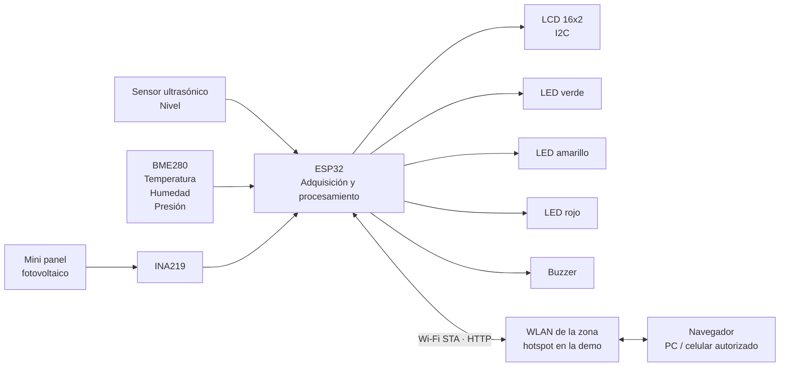
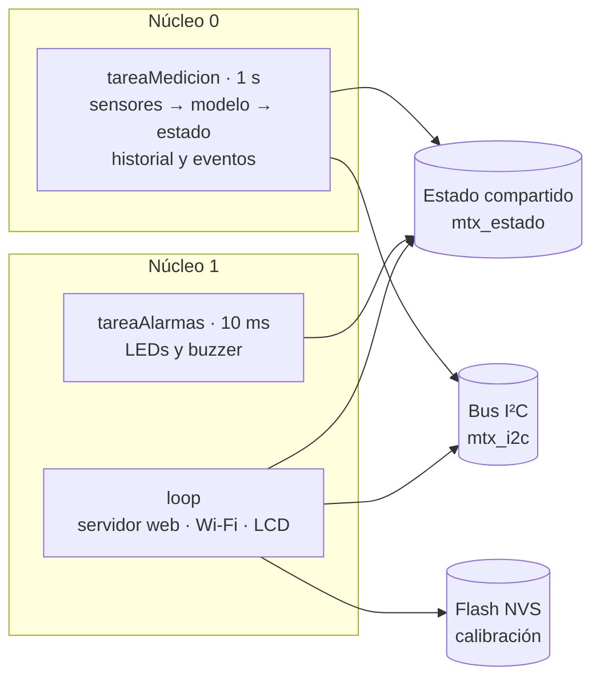
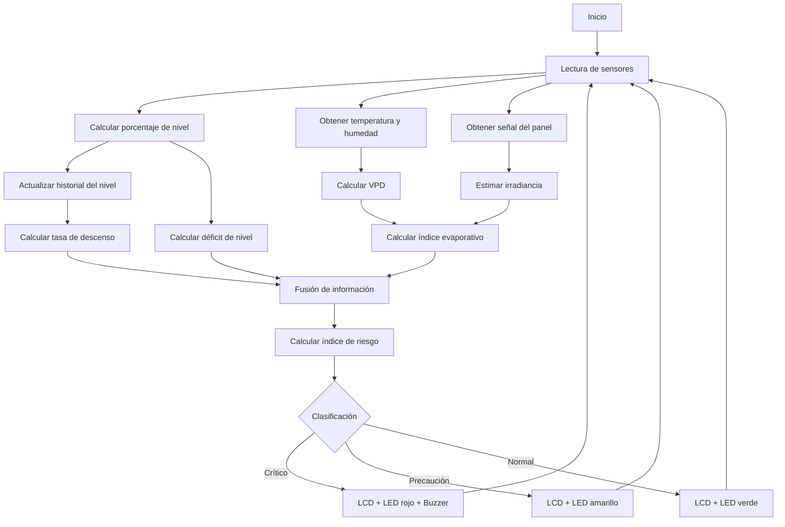

[⬅ Volver al índice](00-Home.md)

# 2. Solución propuesta

## 2.1 Descripción general
**WREWS (Water Risk Early Warning System)** es un prototipo funcional de bajo costo diseñado para monitorear la disponibilidad de agua y generar alertas tempranas de riesgo hídrico.

El sistema utiliza un **ESP32** como unidad central de adquisición y procesamiento. A partir de diferentes sensores se analizan tres dimensiones principales:

1. **Disponibilidad actual de agua**, mediante el nivel.
2. **Condiciones ambientales favorables a la evaporación**, mediante temperatura, humedad e irradiancia estimada.
3. **Tendencia del nivel**, mediante su tasa de descenso.

Estas variables son procesadas y fusionadas localmente para clasificar la situación en tres estados:

- 🟢 **NORMAL**
- 🟡 **PRECAUCIÓN**
- 🔴 **CRÍTICO**

La notificación se realiza de forma completamente local mediante una **pantalla LCD 16×2 I²C**, LEDs de estado y un buzzer.

En el Challenge #2 se añade un **tablero de control web** alojado en un servidor embebido en el ESP32 y publicado en la WLAN de la zona. Desde un navegador (PC o celular conectado a esa WLAN, con usuario y contraseña) las autoridades ven el valor actual y el histórico reciente de las variables, reciben avisos de cada cambio de estado, silencian la alarma física y calibran el equipo.

---

## 2.2 Restricciones y decisiones de diseño

| Tipo | Restricción / necesidad | Decisión de diseño |
|---|---|---|
| **Técnica** | El sistema debe monitorear la disponibilidad de agua | Se utiliza un sensor ultrasónico OKY3261/HC-SR04 para medir la distancia hasta la superficie y convertirla en porcentaje de nivel |
| **Técnica** | Deben considerarse variables ambientales | Se utiliza un BME280 para adquirir temperatura, humedad relativa y presión atmosférica |
| **Técnica** | Se requiere considerar la radiación solar | Se utiliza un mini panel fotovoltaico junto con un INA219 para obtener una señal relacionada con la irradiancia recibida |
| **Técnica** | Se requiere notificación *in situ* con alarma física y visualización en tiempo real | Toda la actuación es local mediante LCD 16×2 I²C, LEDs verde/amarillo/rojo y buzzer, y no depende de la red |
| **Técnica (Ch. #2)** | Tablero de control en un servidor web embebido, conectado a la WLAN de la zona; no MQTT | Servidor HTTP en el ESP32 (librería `WebServer`), en modo estación (STA) sobre la WLAN; sin broker ni nube |
| **Técnica (Ch. #2)** | La medición debe ejecutarse en una ISR o en un hilo distinto al principal | La medición corre en una tarea de FreeRTOS en el núcleo 0; las alarmas en otra tarea del núcleo 1; el servidor y el LCD en `loop()`. Dos mutex protegen el estado compartido y el bus I²C |
| **Seguridad (Ch. #2)** | Acceso al tablero restringido a dispositivos autorizados y conectados a la WLAN de la zona | Doble condición: el cliente debe estar en la misma subred del equipo y tener una sesión iniciada con usuario y contraseña (cookie con token aleatorio de 128 bits, bloqueo tras 5 intentos fallidos) |
| **Operativa (Ch. #2)** | El equipo debe instalarse cerrado, como producto terminado | Carcasa impresa en 3D (PETG), sensor de nivel dentro de un tubo de PVC sanitario de 3", alimentación por pilas con interruptor, y calibración desde el tablero sin abrir la caja |
| **Robustez (Ch. #2)** | Pérdida y reconexión de la WLAN | La alarma física no depende de la red; el ESP32 se reconecta solo y admite hasta dos redes configuradas |
| **Regulatoria · eléctrica** | Seguridad eléctrica cerca del agua: RETIE [32] | Todo funciona en muy baja tensión (pilas, 5 V y 3.3 V) dentro de la carcasa; no hay 110 V cerca del agua |
| **Regulatoria · agua** | Infraestructura de acueducto: Resolución 0330 de 2017, RAS [33] | El equipo es complementario: mide sin contacto dentro de un tubo de PVC y no interviene la tubería ni la operación del acueducto |
| **Regulatoria · intemperie** | Grado de protección de la envolvente: IEC 60529 [34] | Carcasa cerrada con el BME280 bajo un techo ventilado; el grado IP no se ensayó y se declara como trabajo futuro |
| **Regulatoria · gestión del riesgo** | Ley 1523 de 2012 [35]: a quién se reporta | El tablero está pensado para la junta de acueducto y la unidad municipal de gestión del riesgo; el registro de eventos con su hora sirve de soporte para el reporte |
| **Regulatoria · datos** | Ley 1581 de 2012 [36] | El tablero no maneja datos personales; el acceso es restringido y cada inicio de sesión y cada clave incorrecta quedan registrados con la dirección del dispositivo |
| **Regulatoria · espectro** | Uso de radiofrecuencia [37] | Wi-Fi en la banda de 2.4 GHz, de uso libre en Colombia |
| **Temporal** | Entrega en dos semanas a partir del Challenge #1 | Se reutilizaron ESP32, sensores, LCD y la lógica de fusión; lo nuevo se construyó por etapas (modelo, hilos, Wi-Fi y tablero, calibración) probando cada una en el hardware |
| **Temporal · muestreo** | Fenómenos lentos, pero la tasa necesita muchas muestras | Medición cada 1 s (mediana de 5 ecos para el nivel); evaporación sobre una ventana móvil; historial del tablero con un punto cada 2 s durante 10 min |
| **Técnica** | Los sensores utilizan diferentes interfaces | BME280, INA219 y LCD utilizan el bus I²C; el sensor ultrasónico utiliza GPIO digital para TRIG y ECHO |
| **Técnica** | El sistema debe detectar cambios en el comportamiento del nivel | Se comparan mediciones sucesivas para estimar la tasa de descenso |
| **Técnica** | Una condición crítica no debe quedar oculta por un promedio | Además del índice ponderado se utilizan reglas de seguridad independientes |
| **Económica** | El prototipo debe ser de bajo costo | Se seleccionaron componentes comerciales, accesibles y reutilizables |
| **Operativa** | El usuario debe interpretar fácilmente el estado | Se utilizan tres estados y una codificación semafórica: verde, amarillo y rojo |
| **Operativa** | El sistema debe funcionar sin infraestructura externa | Todo el procesamiento se ejecuta localmente en el ESP32 |

---

## 2.3 Variables monitoreadas

WREWS adquiere o calcula las siguientes variables:

| Variable | Fuente | Uso |
|---|---|---|
| Distancia | Sensor ultrasónico | Medición base para determinar el nivel |
| Nivel (%) | Calculado | Representa la disponibilidad actual de agua |
| Temperatura | BME280 | Cálculo de condiciones ambientales |
| Humedad relativa | BME280 | Cálculo de condiciones ambientales |
| Presión atmosférica | BME280 | Variable ambiental de contexto |
| Señal del panel | Panel + INA219 | Estimación de irradiancia |
| Irradiancia estimada | Calculada | Evaluación de condiciones favorables a la evaporación |
| VPD | Calculado | Representa la demanda evaporativa de la atmósfera |
| Radiación neta y evaporación potencial (mm/día) | Calculadas (Priestley-Taylor + FAO-56) | Estimación física de la evaporación de agua libre a escala diaria |
| Índice evaporativo | Calculado | Resume las condiciones favorables a la evaporación |
| Tasa de descenso | Calculada | Representa la tendencia del nivel |
| Índice de riesgo | Calculado | Fusión de disponibilidad, ambiente y tendencia |
| Estado | Calculado | NORMAL, PRECAUCIÓN o CRÍTICO |

---

## 2.4 Arquitectura general


```mermaid
flowchart LR

    ULTRA[Sensor ultrasónico<br/>Nivel]
    BME[BME280<br/>Temperatura<br/>Humedad<br/>Presión]
    PANEL[Mini panel<br/>fotovoltaico]
    INA[INA219]

    MCU[ESP32<br/>Adquisición y procesamiento]

    LCD[LCD 16x2<br/>I2C]
    LEDV[LED verde]
    LEDA[LED amarillo]
    LEDR[LED rojo]
    BUZZ[Buzzer]

    PANEL --> INA

    ULTRA --> MCU
    BME --> MCU
    INA --> MCU

    MCU --> LCD
    MCU --> LEDV
    MCU --> LEDA
    MCU --> LEDR
    MCU --> BUZZ

    WLAN[WLAN de la zona<br/>hotspot en la demo]
    NAV[Navegador<br/>PC / celular autorizado]
    MCU <-->|Wi-Fi STA · HTTP| WLAN
    WLAN <--> NAV
```

El **ESP32** constituye el núcleo del sistema.

Los sensores proporcionan la información de entrada, el microcontrolador realiza los cálculos y finalmente controla los dispositivos de salida según el riesgo detectado.

En el Challenge #2 el mismo ESP32 sirve el tablero de control: se une como estación a la WLAN de la zona y responde a los navegadores autorizados dentro de ella. No hay broker, nube ni servidor externo.

### Diagrama de bloques del software (Challenge #2)


```mermaid
flowchart LR
    subgraph N0["Núcleo 0"]
        TM[tareaMedicion · 1 s<br/>sensores → modelo → estado<br/>historial y eventos]
    end
    subgraph N1["Núcleo 1"]
        TA[tareaAlarmas · 10 ms<br/>LEDs y buzzer]
        LP[loop<br/>servidor web · Wi-Fi · LCD]
    end
    EST[(Estado compartido<br/>mtx_estado)]
    I2C[(Bus I²C<br/>mtx_i2c)]
    NVS[(Flash NVS<br/>calibración)]

    TM --> EST
    TA --> EST
    LP --> EST
    TM --> I2C
    LP --> I2C
    LP --> NVS
```

---

## 2.5 Flujo de procesamiento

El funcionamiento general de WREWS sigue el siguiente flujo:


```mermaid
flowchart TD

    A[Inicio] --> B[Lectura de sensores]

    B --> C[Calcular porcentaje de nivel]
    B --> D[Obtener temperatura y humedad]
    B --> E[Obtener señal del panel]

    D --> F[Calcular VPD]
    E --> G[Estimar irradiancia]

    F --> H[Calcular índice evaporativo]
    G --> H

    C --> I[Actualizar historial del nivel]
    I --> J[Calcular tasa de descenso]

    C --> K[Calcular déficit de nivel]

    K --> L[Fusión de información]
    H --> L
    J --> L

    L --> M[Calcular índice de riesgo]

    M --> N{Clasificación}

    N -->|Crítico| O[LCD + LED rojo + Buzzer]
    N -->|Precaución| P[LCD + LED amarillo]
    N -->|Normal| Q[LCD + LED verde]

    O --> B
    P --> B
    Q --> B
```

---

## 2.6 Medición del nivel

El sensor ultrasónico se instala sobre el punto de almacenamiento y mide la distancia hasta la superficie.

La relación general es:

```text
Distancia pequeña
        ↓
Nivel alto

Distancia grande
        ↓
Nivel bajo
```

El porcentaje de nivel se obtiene mediante una calibración basada en las posiciones correspondientes a lleno y vacío.

De forma general:

```text
Nivel (%) =
100 × (Distancia_vacío - Distancia_medida)
      -------------------------------------
      (Distancia_vacío - Distancia_lleno)
```

El resultado se limita al rango:

```text
0 % ≤ Nivel ≤ 100 %
```

En la implementación física, los valores de calibración corresponden a las dimensiones reales de la maqueta.

Para las pruebas se utiliza una **plataforma móvil que representa la superficie del agua**. Al modificar su altura se pueden reproducir diferentes niveles de manera controlada.

---

## 2.7 Condiciones ambientales

### Temperatura, humedad y presión

El BME280 proporciona:

```text
Temperatura
Humedad relativa
Presión atmosférica
```

La temperatura y la humedad se utilizan para calcular el **VPD — Vapor Pressure Deficit**.

Conceptualmente:

```text
TEMPERATURA ──┐
              ├──→ VPD
HUMEDAD ──────┘
```

Un VPD mayor representa condiciones atmosféricas más favorables para la pérdida de agua por evaporación.

La presión atmosférica se conserva como una variable ambiental complementaria.

Debido a que su variación esperada en un punto fijo es relativamente pequeña, no participa directamente como disparador principal del riesgo.

---

## 2.8 Estimación de irradiancia

La radiación solar se representa mediante un mini panel fotovoltaico.

La cadena de adquisición es:

```text
RADIACIÓN
    ↓
PANEL FOTOVOLTAICO
    ↓
INA219
    ↓
SEÑAL ELÉCTRICA
    ↓
IRRADIANCIA ESTIMADA
```

Cuando aumenta la energía luminosa recibida por el panel, cambia su respuesta eléctrica.

El INA219 permite adquirir esta señal para que el ESP32 pueda utilizarla dentro del procesamiento.

La irradiancia obtenida debe interpretarse como una **estimación experimental**.

El panel fotovoltaico no sustituye un piranómetro calibrado, por lo que una medición metrológica precisa en W/m² requeriría una calibración frente a un instrumento de referencia.

---

## 2.9 Índice de condiciones favorables a la evaporación

En el Challenge #2, WREWS estima la **evaporación potencial diaria** con el modelo de **Priestley-Taylor**, usando las ecuaciones de **FAO-56** para la radiación neta y los parámetros psicrométricos, y la combina con el VPD.

Conceptualmente:

```text
PANEL → INA219 → IRRADIANCIA ──┐
                               ├──→ RADIACIÓN NETA ──┐
TEMPERATURA · HUMEDAD ─────────┘                     ├──→ EVAPORACIÓN (mm/día) ── 70 %──┐
TEMPERATURA · PRESIÓN ───────────→ Δ/(Δ+γ) ──────────┘                                  ├──→ ÍNDICE EVAPORATIVO
TEMPERATURA · HUMEDAD ───────────→ VPD de la ventana ────────────────────────── 30 % ───┘
```

El resultado representa qué tan favorables son las condiciones ambientales para la evaporación. El detalle del modelo, sus constantes y sus referencias están en la [Sección 3.2.3](03-Desarrollo-Modular.md).

Es importante señalar que:

> **El índice evaporativo no representa el porcentaje de agua que se ha evaporado.**

Representa un indicador relativo de las **condiciones ambientales que favorecen la evaporación**.

---

## 2.10 Tasa de descenso

Una medición instantánea del nivel no permite determinar cómo está evolucionando el almacenamiento.

Por esta razón, WREWS compara mediciones tomadas en diferentes momentos.

Conceptualmente:

```text
Nivel anterior - Nivel actual
-----------------------------
       Tiempo transcurrido
```

Esto permite estimar la **tasa de descenso del nivel**.

Por ejemplo:

```text
Reservorio A
Nivel = 50 %
Tasa ≈ 0
→ relativamente estable

Reservorio B
Nivel = 50 %
Tasa de descenso alta
→ disponibilidad disminuyendo rápidamente
```

De esta forma, la tendencia aporta información adicional a la disponibilidad instantánea.

---

## 2.11 Fusión de información

La lógica principal combina tres componentes:

```text
                 WREWS

       DISPONIBILIDAD ACTUAL
          Déficit de nivel
                54 %
                 │
                 │
CONDICIONES ─────┼───── TENDENCIA
AMBIENTALES      │      DEL NIVEL
Priestley-Taylor │      Tasa de
+ VPD            │      descenso
30 %             │      16 %
                 │
                 ▼
          ÍNDICE DE RIESGO
                 │
                 ▼
       NORMAL / PRECAUCIÓN /
              CRÍTICO
```

La ponderación utilizada es:

```text
Riesgo =
0.54 × Déficit de nivel
+
0.30 × Índice evaporativo
+
0.16 × Tendencia
```

La mayor ponderación corresponde al nivel porque la **disponibilidad actual de agua constituye la variable principal del problema**. En el Challenge #2 los pesos pasaron de 50/30/20 a 54/30/16: son el vector de pesos del método AHP de Saaty aplicado a la comparación por pares de las tres señales (ver [Sección 3.2.5](03-Desarrollo-Modular.md)).

Las condiciones ambientales permiten anticipar escenarios favorables a una mayor pérdida de agua y la tendencia permite identificar reducciones aceleradas.

---

## 2.12 Reglas de seguridad

El índice ponderado no constituye el único mecanismo de decisión.

WREWS incorpora reglas de seguridad para condiciones individuales extremas.

Esto evita una situación como:

```text
Nivel extremadamente bajo
+
Ambiente favorable
+
Tasa estable
```

en la que el promedio matemático pudiera reducir artificialmente la percepción del riesgo.

Por tanto:

```text
ÍNDICE PONDERADO
       +
REGLAS DE SEGURIDAD
       ↓
ESTADO FINAL
```

Excepción introducida en el Challenge #2: la **evaporación por sí sola lleva como máximo a PRECAUCIÓN**. La evaporación es un forzante, no la disponibilidad de agua: un mediodía seco y soleado con el embalse lleno no es una emergencia. Su severidad completa se sigue mostrando en el tablero y entra al riesgo combinado con su peso, de modo que con el nivel bajo el riesgo sí lleva a CRÍTICO.

---

## 2.13 Estados del sistema

### 🟢 NORMAL

Representa condiciones en las que la disponibilidad de agua y los demás indicadores no muestran un riesgo significativo.

Respuesta local:

```text
LCD → NORMAL
LED verde → activo
Buzzer → apagado
```

### 🟡 PRECAUCIÓN

Indica que una o varias variables han alcanzado condiciones que justifican atención.

Respuesta local:

```text
LCD → PRECAUCIÓN
LED amarillo → activo
Buzzer → pitido grave corto (1000 Hz, 150 ms cada 4 s)
```

### 🔴 CRÍTICO

Representa una situación de riesgo elevado o una condición individual considerada crítica.

Respuesta local:

```text
LCD → CRÍTICO
LED rojo → parpadea
Buzzer → alarma sonora (2000 Hz, 250 ms cada 1.2 s)
```

### ⚙️ FALLO

Condición del equipo, no nivel de riesgo: sin eco del sensor de nivel o sin BME280 en el bus I²C.

```text
LEDs → los tres parpadean a la vez
Buzzer → tono muy grave (600 Hz, 120 ms cada 3 s)
```

En todos los estados el buzzer puede **silenciarse durante 15 minutos desde el tablero de control**; los LEDs siguen mostrando el estado, y si este empeora el silencio se cancela solo.

---

## 2.14 Visualización local

La implementación física utiliza una **LCD 16×2 I²C**.

Debido al espacio disponible en la pantalla, la información se organiza para presentar las variables más relevantes y el estado del sistema sin interferir con el procesamiento interno.

En el firmware v7 la LCD rota cada 2.5 s entre siete páginas:

| Página | Línea 1 | Línea 2 |
|---|---|---|
| 1 | Nivel (%) o `SIN ECO` | Estado (y `MUTE` si el buzzer está silenciado) |
| 2 | Temperatura | Humedad relativa |
| 3 | Presión | VPD |
| 4 | Irradiancia (`NOCHE` si < 5 W/m²) | Índice evaporativo, o `calc NN%` mientras se llena la ventana |
| 5 | Severidad de cada variable y riesgo | Tasa de descenso |
| 6 | Evaporación potencial (mm/día) | Radiación neta y modo (DEMO/CAMPO) |
| 7 | Estado del Wi-Fi | **IP del tablero** (o `buscando red...`) |

Los LEDs permiten interpretar rápidamente la clasificación:

```text
🟢 Verde     → NORMAL
🟡 Amarillo  → PRECAUCIÓN
🔴 Rojo      → CRÍTICO
```

El buzzer añade una señal sonora cuando se identifica una condición crítica, con un tono distinto para precaución, crítico y fallo.

---

## 2.15 Alerta local independiente de la red

Una característica importante del diseño es que la generación de la alerta no depende de infraestructura externa. En el Challenge #2 el tablero web se suma como un segundo canal de notificación, pero la cadena de abajo sigue completa aunque la WLAN no esté disponible.

Todo ocurre dentro del dispositivo:

```text
SENSORES
   ↓
ESP32
   ↓
PROCESAMIENTO
   ↓
DECISIÓN
   ↓
LCD + LEDs + BUZZER
```

No se requiere:

- Wi-Fi;
- Bluetooth;
- LoRa;
- GSM;
- servicios en la nube;
- conexión a Internet.

Esto permite que el sistema continúe generando alertas locales incluso en un lugar sin conectividad.

---

## 2.16 Simulación e implementación física

El desarrollo se realizó en dos etapas.

### Simulación

Wokwi permitió:

- diseñar la arquitectura;
- probar sensores;
- desarrollar *custom chips*;
- comprobar el bus I²C;
- probar escenarios controlados;
- verificar la lógica de riesgo;
- depurar el firmware.

La simulación original utiliza algunos componentes virtuales diferentes a los finalmente disponibles para el montaje físico.

### Implementación física

Posteriormente se integraron los componentes reales y se ajustó el sistema a las características de la maqueta.

La pantalla utilizada en el prototipo físico final es una **LCD 16×2 I²C**, seleccionada por disponibilidad y porque permite cumplir el requisito de visualización local.

Por tanto, la simulación debe entenderse como una etapa de desarrollo y validación previa, mientras que la implementación física representa la versión final presentada en el Challenge.

### Producto terminado (Challenge #2)

En el Challenge #2 el prototipo deja la maqueta de laboratorio y se integra como un equipo listo para instalar:

- **Carcasa** impresa en 3D en PETG, diseñada en CadQuery, con el ESP32, el INA219, el LCD, los LEDs y el buzzer dentro, el BME280 bajo un techo con rejillas de ventilación y el panel solar en la parte superior.
- **Sensor de nivel** dentro de un tubo de PVC sanitario de 3" (40 a 50 cm, con entradas de agua en la parte inferior), que se instala en el punto de almacenamiento.
- **Alimentación** por un portapilas 4×AA con interruptor.
- **Tablero de control** en la WLAN de la zona, que permite calibrar el equipo con la carcasa cerrada.

El detalle está en las [Secciones 3.14 a 3.19](03-Desarrollo-Modular.md).

---

## 2.17 Locación y contexto físico (Challenge #2)

| Aspecto | Definición del equipo |
|---|---|
| **Punto crítico** | Lago del campus de la Universidad de La Sabana (Chía, Sabana Centro) como sitio de instalación y pruebas; como alternativa, el tanque de un acueducto veredal de Chía o Cajicá. El nodo se instala en la orilla, anclado a un poste o baranda, y mide dentro de un tubo de PVC que llega por debajo del nivel mínimo |
| **Ambiente** | Intemperie a ≈ 2560 m s. n. m.: lluvia, radiación UV alta, heladas en temporada seca y humedad alta en la noche |
| **Alimentación** | Pilas en el prototipo; en campo, red de 5 V con respaldo o panel solar con baterías. El servidor web obliga a tener el Wi-Fi siempre encendido |
| **Conectividad** | WLAN de la junta o la alcaldía, con el punto de acceso a ≤ 30 m y línea de vista; objetivo de señal ≥ −70 dBm en el punto de instalación |
| **Acceso y mantenimiento** | Montaje con tornillería antivandalismo; mantenimiento mensual (limpiar el sensor, revisar la alimentación); calibración desde el tablero, sin tocar el agua |
| **Rango de variables** | Nivel: 0–2 m en un tanque típico (en el prototipo, el recorrido del tubo); temperatura ≈ 0–25 °C; HR 40–95 %; presión ≈ 750 hPa; radiación hasta ≈ 1100–1200 W/m² al mediodía |
| **Seguridad del sitio** | Solo muy baja tensión dentro de la caja; nada de 110 V cerca del agua |

⟨completar: fotos del sitio, medidas y RSSI medido en el punto de instalación, si se hizo la visita⟩

---

[⬅ Anterior: Resumen y motivación](01-Resumen-Motivacion.md) · [⬆ Índice](00-Home.md) · [Siguiente: Desarrollo modular ➡](03-Desarrollo-Modular.md)