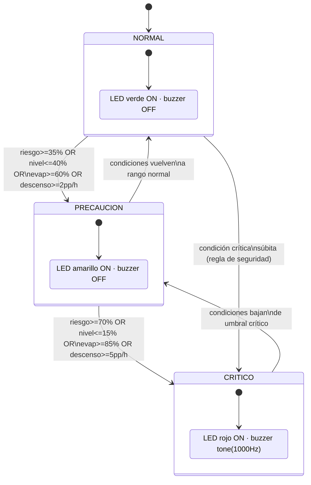
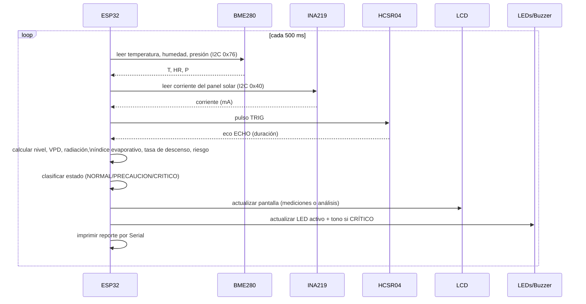
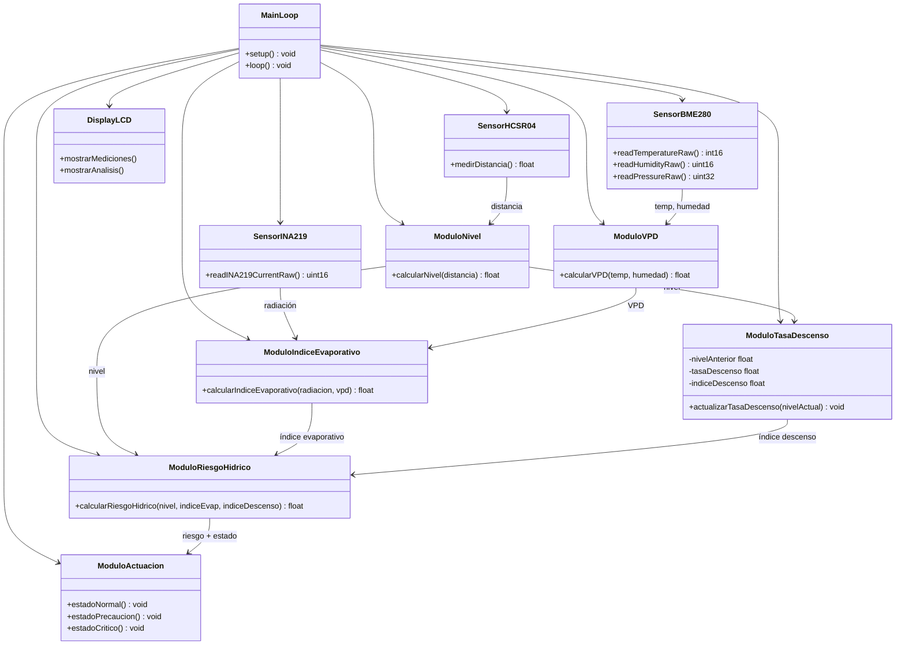
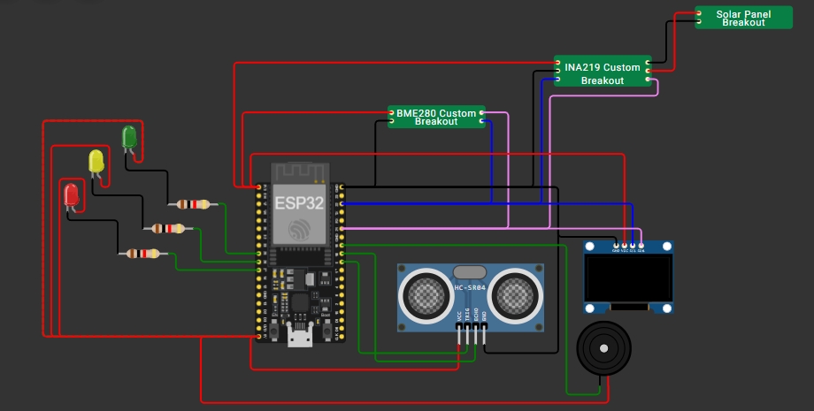

[⬅ Volver al índice](00-Home.md)

# 3. Desarrollo teórico modular

## 3.1 Criterios de diseño establecidos

| Criterio | Decisión de diseño | Justificación |
|---|---|---|
| **Independencia de red** | Toda la lógica de decisión corre en el ESP32; no hay llamadas a servicios externos | Cumple la restricción de notificación *in situ* sin redes de comunicación |
| **Modularidad funcional** | El firmware se organiza en funciones puras por responsabilidad (lectura de sensores, cálculo de nivel, cálculo de VPD, cálculo de índice evaporativo, cálculo de tasa de descenso, cálculo de riesgo, actuación) | Facilita pruebas unitarias, mantenimiento y reemplazo de sensores sin reescribir la lógica de fusión |
| **Múltiples señales, una decisión** | El riesgo hídrico no depende de una sola variable, sino de la fusión ponderada de tres índices + reglas de seguridad | Responde directamente a la pregunta guía del reto: "combinar múltiples señales ambientales críticas mediante lógica de fusión" |
| **Ninguna variable crítica queda oculta por el promedio** | Se agregan reglas de seguridad (*hard thresholds*) independientes al promedio ponderado | Evita falsos negativos: p. ej., un nivel del 10 % con bajo índice evaporativo no debe "diluirse" a un estado NORMAL |
| **Calibración simple y replicable** | El nivel se calibra con solo 2 parámetros (`DISTANCIA_LLENO`, `DISTANCIA_VACIO`) | Permite reutilizar el mismo firmware en distintos reservorios de la región Sabana Centro |
| **Simulación antes de hardware físico** | Validación completa en Wokwi con *custom chips* en C antes de ensamblar hardware real | Reduce riesgo y costo de iteración; permite verificar la lógica de fusión con controles interactivos |
| **Bajo consumo / operación remota** | Alimentación por batería recargable con panel solar; ciclo de refresco de pantalla de 500 ms (no continuo a máxima velocidad) | Extiende la autonomía en campo, donde no siempre hay red eléctrica |
| **Legibilidad para usuarios no técnicos** | El LCD alterna dos pantallas (mediciones crudas / análisis y estado) y los LEDs usan el código de color universal semáforo (verde/amarillo/rojo) | La alerta debe ser comprensible por miembros de la comunidad sin formación técnica |

## 3.2 Modelo matemático de fusión de datos

### 3.2.1 Nivel del reservorio

$$Nivel\ (\%) = \frac{D_{vacío} - D_{medida}}{D_{vacío} - D_{lleno}} \times 100 \quad \text{(saturado entre 0 y 100)}$$

En la maqueta simulada: `D_lleno = 3 cm` (100 %), `D_vacío = 20 cm` (0 %).

### 3.2.2 Déficit de presión de vapor (VPD)

$$e_s = 0.6108 \cdot e^{\frac{17.27\,T}{T + 237.3}} \qquad e_a = e_s \cdot \frac{HR}{100} \qquad VPD = e_s - e_a \ \text{[kPa]}$$

Un VPD mayor indica un aire con mayor capacidad de "aceptar" vapor de agua adicional, es decir, condiciones más favorables para la evaporación.

### 3.2.3 Índice evaporativo

$$Indice_{evap}\ (\%) = 100 \times \left[0.50 \cdot \min\!\left(\frac{Radiación}{1000},1\right) + 0.50 \cdot \min\!\left(\frac{VPD}{3},1\right)\right]$$

Este porcentaje **no** representa la fracción de agua que se evaporará; representa qué tan intensas son, en una escala relativa 0–100 %, las condiciones ambientales para la pérdida de agua por evaporación.

### 3.2.4 Tasa e índice de descenso

$$Tasa\ (pp/h) = Nivel_{anterior} - Nivel_{actual} \quad (\text{si es negativa, se trunca a 0})$$

$$Indice_{descenso}\ (\%) = \min\!\left(\frac{Tasa}{5.0},\,1\right)\times 100$$

En simulación, cada **10 segundos** representa **1 hora** real (`INTERVALO_TASA_MS = 10000`), lo que permite observar tendencias de descenso sin esperar tiempo real. En hardware físico, esta constante se reconfigura a `3 600 000 ms`.

### 3.2.5 Riesgo hídrico (fusión final)

$$Riesgo\ (\%) = 0.50 \cdot (100 - Nivel) + 0.30 \cdot Indice_{evap} + 0.20 \cdot Indice_{descenso}$$

### 3.2.6 Reglas de clasificación de estado

| Estado | Condición (basta con que se cumpla **una**) |
|---|---|
| 🔴 **CRÍTICO** | Riesgo ≥ 70 % **o** Nivel ≤ 15 % **o** Índice evaporativo ≥ 85 % **o** Tasa de descenso ≥ 5 pp/h |
| 🟡 **PRECAUCIÓN** | Riesgo ≥ 35 % **o** Nivel ≤ 40 % **o** Índice evaporativo ≥ 60 % **o** Tasa de descenso ≥ 2 pp/h |
| 🟢 **NORMAL** | Ninguna de las anteriores |

> Estos umbrales son parámetros iniciales de diseño (definidos en las constantes `TASA_PRECAUCION`, `TASA_CRITICA`, `RADIACION_REFERENCIA`, `VPD_REFERENCIA` del firmware) y deben ajustarse experimentalmente según la geometría real de cada reservorio y las condiciones climáticas locales de cada punto de instalación en Sabana Centro.

## 3.3 Diagramas UML

### 3.3.1 Diagrama de estados (máquina de estados de alerta)



### 3.3.2 Diagrama de secuencia (un ciclo de medición)



### 3.3.3 Diagrama de componentes / módulos de software



## 3.4 Esquemático de hardware



*(Imagen también disponible en [`/hardware/schematics/diagrama_circuito_wokwi.png`](../hardware/schematics/diagrama_circuito_wokwi.png); diagrama fuente editable en [`/hardware/wokwi/diagram.json`](../hardware/wokwi/diagram.json)).*

### 3.4.1 Mapa de pines (ESP32 DevKit-C)

| Pin ESP32 | Conectado a | Función |
|---|---|---|
| `3V3` | VCC de BME280, INA219 | Alimentación 3.3 V (bus I²C) |
| `5V` | VCC de HC-SR04, LED rojo (ánodo), Buzzer (+) | Alimentación 5 V |
| `GND` | GND común de todos los módulos | Tierra común |
| `GPIO 21 (SDA)` | SDA de BME280, INA219 y LCD | Bus I²C — datos |
| `GPIO 22 (SCL)` | SCL de BME280, INA219 y LCD | Bus I²C — reloj |
| `GPIO 5` | TRIG del HC-SR04 | Disparo del pulso ultrasónico |
| `GPIO 18` | ECHO del HC-SR04 (vía divisor resistivo 1 kΩ/2 kΩ) | Recepción del eco (nivel de agua) |
| `GPIO 25` | Resistencia 220 Ω → LED verde | Estado NORMAL |
| `GPIO 26` | Resistencia 220 Ω → LED amarillo | Estado PRECAUCIÓN |
| `GPIO 27` | Resistencia 220 Ω → LED rojo | Estado CRÍTICO |
| `GPIO 19` | Buzzer (−) | Alarma sonora |
| — | Panel solar `POS/NEG` → INA219 `VIN+/VIN-` | Señal analógica de radiación solar |

> **Nota de diseño:** en el circuito, los LEDs se conectan con lógica **activa en bajo** (`LOW` = encendido, `HIGH` = apagado), documentado explícitamente en el firmware (`sketch.ino`, sección `LEDS`).

## 3.5 Alimentación y energía

Para la versión portátil (fuera del laboratorio/simulación) se dimensionó la siguiente cadena de energía:

```
Panel solar → (recarga) → Batería Li-ion 18650 (3.7 V) → TP4056 (carga + protección) → MT3608 (boost a 5 V) → ESP32
```

Todos los módulos comparten **GND común**. Para pruebas de escritorio también es válida la alimentación directa por cable USB o *power bank*, migrando posteriormente a la batería para despliegue en campo.

## 3.6 Estándares de ingeniería aplicados

| Estándar / buena práctica | Aplicación en el proyecto |
|---|---|
| **I²C — NXP UM10204 (Philips/NXP I2C-bus specification)** | Comunicación entre ESP32, BME280, INA219 y LCD |
| **ANSI/ISA-18.2 (gestión de alarmas industriales)** | Principio de jerarquía de alarmas (NORMAL/PRECAUCIÓN/CRÍTICO) con reglas de seguridad que priman sobre el promedio ponderado |
| **ANSI Z535.1 / convención semafórica de colores de seguridad** | Uso de verde = seguro, amarillo = precaución, rojo = peligro en LEDs y en la pantalla LCD |
| **ISO/IEC/IEEE 42010:2011 (Architecture description)** | Documentación de la arquitectura mediante vistas de bloques (hardware/software) y diagramas UML |
| **UML 2.5 (OMG)** | Diagramas de estados, secuencia y componentes de la [Sección 3.3](#33-diagramas-uml) |
| **IEEE 830 / buenas prácticas de documentación de requisitos** | Trazabilidad entre restricciones de diseño (Sección 2.1), criterios de diseño (Sección 3.1) y pruebas (Sección 5) |
| **Buenas prácticas de *coding style* Arduino/C++ (comentarios por bloque, nombres descriptivos, funciones de responsabilidad única)** | Estructura del archivo `firmware/sketch.ino` |
| **Guías del IDEAM/OMM para monitoreo hidrometeorológico comunitario** | Selección de variables físicas monitoreadas (nivel, temperatura, humedad, presión, radiación) coherentes con boletines de riesgo hídrico regional |

---
[⬅ Anterior: Solución propuesta](02-Solucion-Propuesta.md) · [⬆ Índice](00-Home.md) · [Siguiente: Modelo de negocio ➡](04-Modelo-de-Negocio.md)
