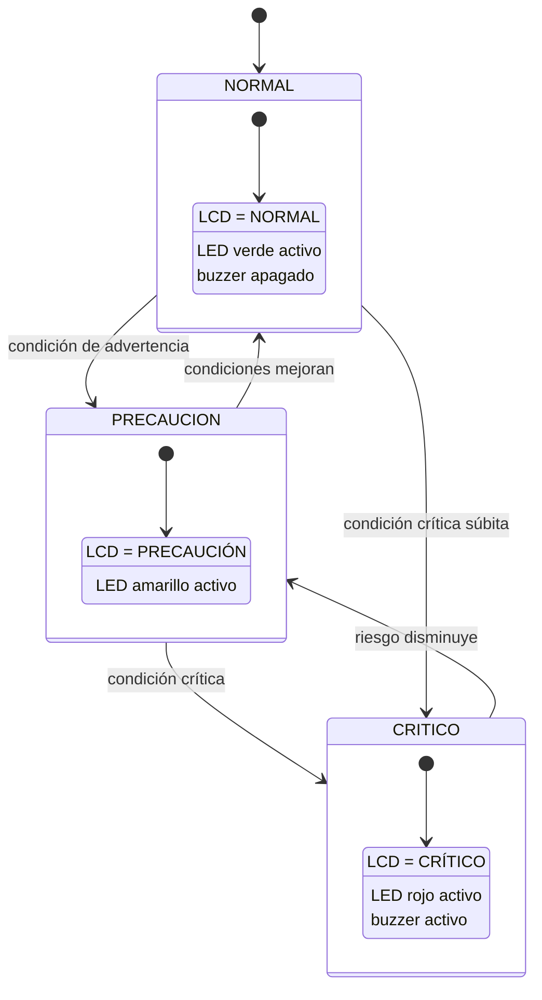
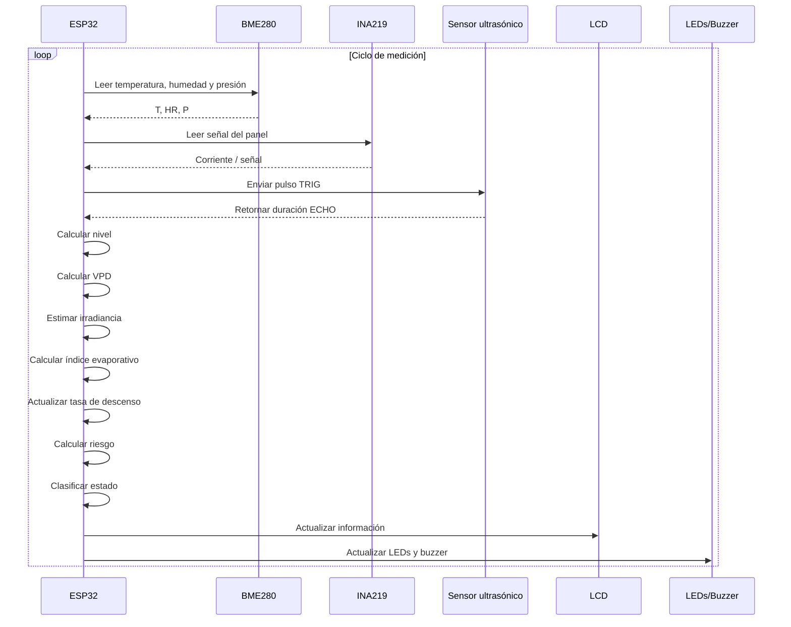
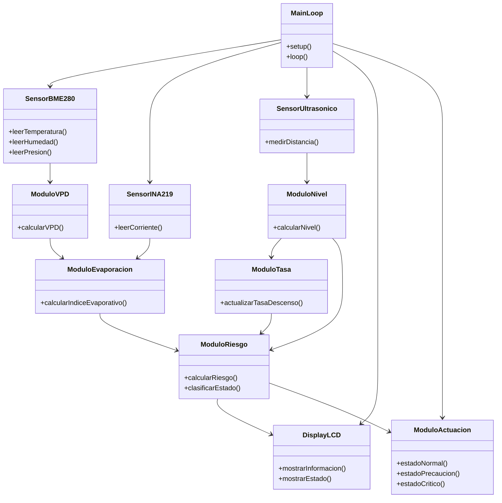

[⬅ Volver al índice](00-Home.md)

# 3. Desarrollo teórico modular

## 3.1 Criterios de diseño establecidos

| Criterio | Decisión de diseño | Justificación |
|---|---|---|
| **Independencia de red** | Toda la lógica de decisión corre en el ESP32; no hay llamadas a servicios externos | Cumple la restricción de notificación *in situ* sin redes de comunicación |
| **Modularidad funcional** | El firmware se organiza por responsabilidades: lectura de sensores, cálculo de nivel, VPD, índice evaporativo, tasa de descenso, riesgo y actuación | Facilita mantenimiento, depuración y reemplazo de sensores |
| **Múltiples señales, una decisión** | El riesgo hídrico depende de la fusión de nivel, condiciones evaporativas y tendencia | Responde a la necesidad de combinar múltiples señales para una alerta más completa |
| **Ninguna variable crítica queda oculta por el promedio** | Se incorporan reglas de seguridad independientes al promedio ponderado | Reduce el riesgo de falsos negativos ante condiciones individuales extremas |
| **Calibración simple** | El nivel se ajusta mediante parámetros de distancia correspondientes a lleno y vacío | Permite adaptar el sistema a distintas geometrías |
| **Simulación antes del montaje físico** | Se validó inicialmente la arquitectura y lógica en Wokwi | Redujo errores antes de integrar sensores reales |
| **Validación física posterior** | El sistema fue implementado sobre una maqueta funcional | Permite verificar sensores, actuadores y comportamiento real del sistema |
| **Legibilidad para usuarios no técnicos** | LCD 16×2 I²C + LEDs semafóricos + buzzer | Facilita la interpretación local del estado |
| **Enfoque en la problemática hídrica** | El nivel y su tendencia son las variables principales; la presión se mantiene como contexto | Mantiene la lógica alineada con el riesgo de disponibilidad y desabastecimiento |

---

## 3.2 Modelo matemático de fusión de datos

### 3.2.1 Nivel del reservorio

El porcentaje de nivel se calcula a partir de la distancia medida por el sensor ultrasónico:

```text
Nivel (%) =
100 × (D_vacío - D_medida)
      ----------------------
      (D_vacío - D_lleno)
```

El resultado se limita al rango:

```text
0 % ≤ Nivel ≤ 100 %
```

En la implementación física, `D_lleno` y `D_vacío` corresponden a la calibración real de la maqueta.

---

### 3.2.2 Déficit de presión de vapor — VPD

La temperatura y la humedad relativa permiten calcular el déficit de presión de vapor.

De forma general:

```text
e_s = presión de vapor de saturación
e_a = presión de vapor actual

VPD = e_s - e_a
```

El VPD representa la capacidad del aire para aceptar vapor de agua adicional.

Un valor mayor indica condiciones más favorables para la evaporación.

---

### 3.2.3 Índice evaporativo

El índice evaporativo combina dos variables normalizadas:

```text
VPD
+
Irradiancia estimada
```

Conceptualmente:

```text
Índice_evap (%) =
50 % componente de irradiancia
+
50 % componente de VPD
```

Este índice:

> **No representa el porcentaje de agua que se evapora.**

Representa, en una escala relativa, qué tan favorables son las condiciones ambientales para la evaporación.

---

### 3.2.4 Tasa e índice de descenso

La primera versión del sistema estimaba la tendencia restando dos mediciones consecutivas de nivel. Ese método resultó inviable ya que con el ruido del sensor la tasa superaba por mucho el umbral crítico, incluso con la plataforma quieta.

La versión final estima la pendiente por **regresión lineal por mínimos cuadrados** sobre una ventana de las últimas 20 mediciones. La regresión promedia el ruido de todas las muestras en vez de depender de dos.

```text
Tasa (pp/min) = − pendiente de la recta ajustada a los pares (tiempo, nivel) de la ventana
```

Cuando el nivel sube, la pendiente se trunca a cero: una recarga no constituye riesgo hídrico.

**Banda muerta.** Por debajo de un umbral derivado del ruido medido del propio sensor, la pendiente se fuerza a cero. Ese umbral se calcula automáticamente en cada arranque (ver Sección 5).

**Discontinuidades.** Un reservorio real no cambia de nivel de forma instantánea. Variaciones superiores a 8 puntos porcentuales entre mediciones consecutivas se interpretan como recarga del reservorio —o, en la maqueta, como reposicionamiento manual de la plataforma— y descartan el historial acumulado de tendencia. Sin este tratamiento, la regresión ajustada sobre un escalón produce una pendiente que crece por sí sola mientras el escalón avanza por la ventana.

**Precauciones numéricas.** El eje temporal se expresa relativo a la muestra más antigua de la ventana. Usando el tiempo absoluto del sistema en punto flotante, los términos del denominador de la regresión se aproximan entre sí y su diferencia se pierde por cancelación a los pocos minutos de encendido.

### 3.2.5 Riesgo hídrico

El riesgo general se calcula mediante:

```text
Riesgo =
0.50 × Déficit de nivel
+
0.30 × Índice evaporativo
+
0.20 × Índice de descenso
```

La mayor ponderación corresponde al nivel porque representa directamente la disponibilidad actual de agua.

---

### 3.2.6 Reglas de clasificación de estado

La lógica de clasificación incorpora el índice ponderado y reglas de seguridad.

| Estado | Condición general |
|---|---|
| 🔴 **CRÍTICO** | Riesgo elevado o alguna variable individual alcanza un umbral crítico |
| 🟡 **PRECAUCIÓN** | Riesgo intermedio o alguna variable supera su umbral de advertencia |
| 🟢 **NORMAL** | Ninguna condición de precaución o crítica está activa |

La implementación utiliza umbrales definidos en el firmware para:

- nivel;
- índice evaporativo;
- tasa de descenso;
- riesgo combinado.

Estos valores corresponden a parámetros iniciales de diseño y pueden recalibrarse para una instalación real.

---

### 3.2.7 Umbrales aplicados

| Variable | PRECAUCIÓN | CRÍTICO | Origen del valor |
|---|---|---|---|
| Nivel del reservorio | ≤ 40 % | ≤ 15 % | Criterio operativo de diseño | Índice evaporativo | ≥ 60 | ≥ 85 | Criterio operativo de diseño | Tasa de descenso | ≥ 33 pp/min | ≥ 68 pp/min | **Calibración experimental** (Sección 5) | Riesgo ponderado | ≥ 35 | ≥ 70 | Criterio operativo de diseño |

Referencias de normalización: irradiancia 1200 W/m² (pico realista a 2550 m de altitud) y VPD 2.0 kPa. Esta última se fijó a partir del clima local: a 24 °C la presión de vapor de saturación es 2.98 kPa, de modo que 2.0 kPa representa una tarde seca del percentil alto de la región. Una referencia mayor dejaría el índice permanentemente por debajo de sus umbrales.

Los umbrales de tasa corresponden al banco de pruebas, donde la plataforma se desplaza manualmente en segundos. No deben interpretarse como límites hidrológicos de un reservorio real: en campo, con una escala temporal de horas, los valores equivalentes serían del orden de 0.03 y 0.08 pp/min.

### 3.2.8 Escalera de estados y confirmación temporal

Las transiciones se producen de un nivel a la vez, incluso cuando las condiciones instantáneas corresponden a un estado dos escalones por encima. Así PRECAUCIÓN es siempre observable, lo que permite anticipar la escalada y deja el historial completo en el registro.

La confirmación es **asimétrica**: dos ciclos consecutivos para escalar y tres para desescalar. Los costos de los dos errores posibles no son equivalentes: alertar tarde en un evento de desabastecimiento puede impedir la respuesta, mientras que sostener una alerta unos segundos de más no tiene costo operativo.

El estado **FALLO** no participa de la escalera. No es un nivel de riesgo sino una condición del equipo —ausencia de eco del ultrasónico, o del BME280 en el bus I²C— y se entra y se sale de forma directa. Su señalización, los tres LEDs parpadeando a la vez, no se confunde con ningún estado operativo: un sistema de alerta que enmudece cuando pierde un sensor es la peor falla posible.

## 3.3 Diagramas UML

### 3.3.1 Diagrama de estados



---

### 3.3.2 Diagrama de secuencia



---

### 3.3.3 Diagrama de componentes de software



---

## 3.4 Arquitectura física

La versión final presentada utiliza los siguientes componentes:

```text
                 ┌───────────────┐
                 │     ESP32     │
                 │ procesamiento │
                 └───────┬───────┘
                         │
       ┌─────────────────┼──────────────────┐
       │                 │                  │
       ▼                 ▼                  ▼
Sensor ultrasónico     BME280        Panel + INA219
Nivel                  T / HR / P     Irradiancia aprox.

                         │
                         ▼
                 Procesamiento local
                         │
                         ▼
              NORMAL / PRECAUCIÓN /
                     CRÍTICO
                         │
          ┌──────────────┼──────────────┐
          ▼              ▼              ▼
      LCD 16×2         LEDs           Buzzer
```

La simulación original de Wokwi se conserva en la carpeta `/hardware/wokwi` como evidencia del proceso de diseño previo.

El hardware físico final utiliza una LCD 16×2 I²C como interfaz local.

---

## 3.5 Comunicación I²C

El sistema aprovecha el bus I²C para conectar varios módulos al ESP32.

Los dispositivos principales son:

| Dispositivo | Interfaz |
|---|---|
| BME280 | I²C |
| INA219 | I²C |
| LCD 16×2 | I²C |

El bus utiliza las líneas:

```text
SDA
SCL
```

compartidas entre los dispositivos.

Cada módulo utiliza una dirección propia, permitiendo que el ESP32 pueda comunicarse con varios periféricos sobre el mismo bus.

---

## 3.6 Sensor ultrasónico

El sensor ultrasónico utiliza dos señales digitales:

```text
TRIG
ECHO
```

El ESP32 genera un pulso sobre `TRIG`.

El sensor responde mediante `ECHO`, cuya duración permite estimar la distancia.

De manera simplificada:

```text
ESP32
  │
  ├── TRIG ──→ Sensor
  │
  └── ECHO ←── Sensor
```

Esta distancia se transforma posteriormente en porcentaje de nivel.

---

## 3.7 Pantalla LCD 16×2 I²C

La interfaz física final utiliza una pantalla LCD 16×2 con adaptador I²C.

La pantalla cumple dos funciones principales:

1. presentar información relevante del sistema;
2. mostrar al usuario el estado de riesgo.

Debido a la limitación de 16 caracteres por 2 filas, la interfaz prioriza la información esencial y organiza las variables en diferentes vistas o ciclos de actualización.

El procesamiento de todas las variables continúa realizándose internamente en el ESP32 aunque no todas se muestren simultáneamente.

---

## 3.8 LEDs y buzzer

Los LEDs utilizan una codificación semafórica:

```text
Verde     → NORMAL
Amarillo  → PRECAUCIÓN
Rojo      → CRÍTICO
```

El buzzer actúa como alarma sonora adicional en el estado crítico.

Esto proporciona dos mecanismos de notificación:

```text
VISUAL
LCD + LEDs

SONORO
Buzzer
```

---

## 3.9 Diseño de la maqueta

Para validar el sensor de nivel se construyó una maqueta con una plataforma móvil.

La plataforma representa la superficie del agua.

```text
Plataforma arriba
       ↓
Distancia pequeña
       ↓
Nivel alto

Plataforma abajo
       ↓
Distancia grande
       ↓
Nivel bajo
```

Esta solución permitió:

- controlar la distancia;
- repetir escenarios;
- observar las transiciones de estado;
- evitar contacto entre agua y electrónica;
- acelerar las pruebas durante la validación.

---

## 3.10 Estrategia de simulación

Antes del montaje físico se desarrolló una versión funcional en Wokwi.

La simulación permitió:

- validar el sensor ultrasónico;
- comprobar el bus I²C;
- simular temperatura, humedad y presión;
- simular el panel y el INA219;
- probar la lógica matemática;
- modificar las variables mediante controles;
- verificar NORMAL, PRECAUCIÓN y CRÍTICO.

En Wokwi se utilizaron *custom chips* para representar componentes que requerían comportamiento configurable.

La simulación original utiliza una pantalla OLED como componente virtual. Posteriormente, durante la implementación física, esta interfaz fue reemplazada por una **LCD 16×2 I²C** disponible para el equipo.

Este cambio no modifica la arquitectura lógica del sistema: ambos dispositivos cumplen la función de visualización local mediante I²C.

---

## 3.11 Estrategia de implementación física

Después de validar la lógica en simulación se integró el prototipo físico.

El proceso general fue:

```text
Prueba del ESP32
      ↓
Sensor ultrasónico
      ↓
LCD + buzzer
      ↓
BME280
      ↓
Panel + INA219
      ↓
LEDs
      ↓
Integración completa
      ↓
Calibración
      ↓
Pruebas de estados
```

Durante esta etapa se realizaron ajustes propios del hardware real, especialmente relacionados con:

- calibración de distancia;
- estabilidad de las lecturas;
- bus I²C;
- actuación de LEDs;
- comportamiento del buzzer;
- organización de la información en la LCD.

---

## 3.12 Estándares y buenas prácticas de ingeniería

| Estándar / práctica | Aplicación |
|---|---|
| **I²C** | Comunicación entre ESP32, BME280, INA219 y LCD |
| **UML** | Modelado de estados, secuencia y componentes |
| **Codificación semafórica** | Verde = normal, amarillo = precaución, rojo = crítico |
| **Diseño modular** | Separación de lectura, procesamiento, fusión y actuación |
| **Validación progresiva** | Simulación antes de implementación física |
| **Reglas de seguridad** | Condiciones críticas individuales pueden prevalecer sobre el promedio |
| **Procesamiento local** | El sistema no depende de servicios externos para generar alertas |
| **Calibración** | Los parámetros del nivel se ajustan a la geometría del sistema evaluado |

---

## 3.13 Flujo completo del sistema

```text
SENSOR ULTRASÓNICO
        ↓
      NIVEL
        │
        │
        ├───────────────────────────┐
        │                           │
        ▼                           │
 DÉFICIT DE NIVEL                   │
      50 %                          │
                                    │
BME280                              │
T + HR                              │
  ↓                                 │
 VPD ─────────┐                     │
              ├→ ÍNDICE EVAP. ─────┤
PANEL         │       30 %          │
  ↓           │                     │
INA219        │                     │
  ↓           │                     │
IRRADIANCIA ──┘                     │
                                    ├→ RIESGO
NIVEL EN EL TIEMPO                  │
        ↓                           │
TASA DE DESCENSO ───────────────────┘
       20 %
        ↓
REGLAS DE SEGURIDAD
        ↓
NORMAL / PRECAUCIÓN / CRÍTICO
        ↓
LCD + LEDs + Buzzer
```

---

[⬅ Anterior: Solución propuesta](02-Solucion-Propuesta.md) · [⬆ Índice](00-Home.md) · [Siguiente: Modelo de negocio ➡](04-Modelo-de-Negocio.md)
