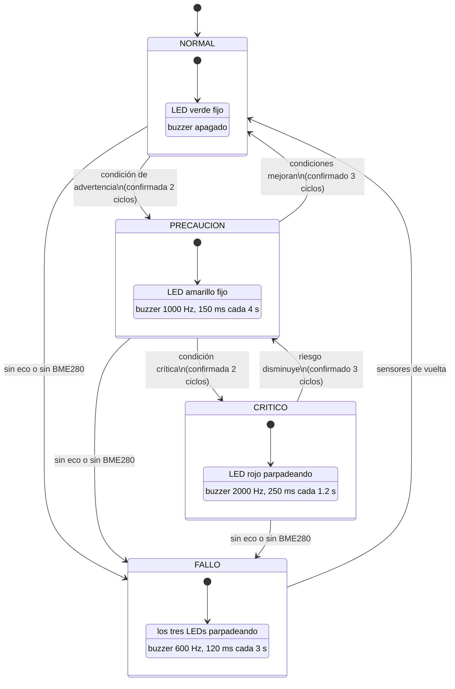
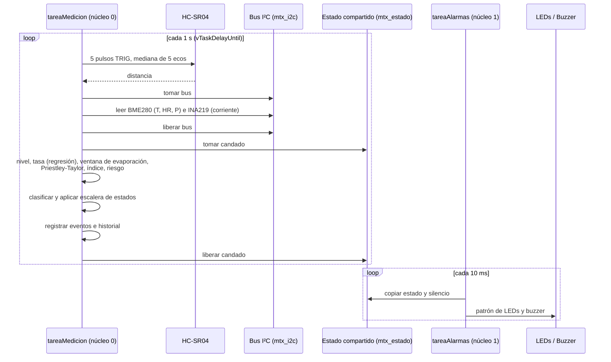
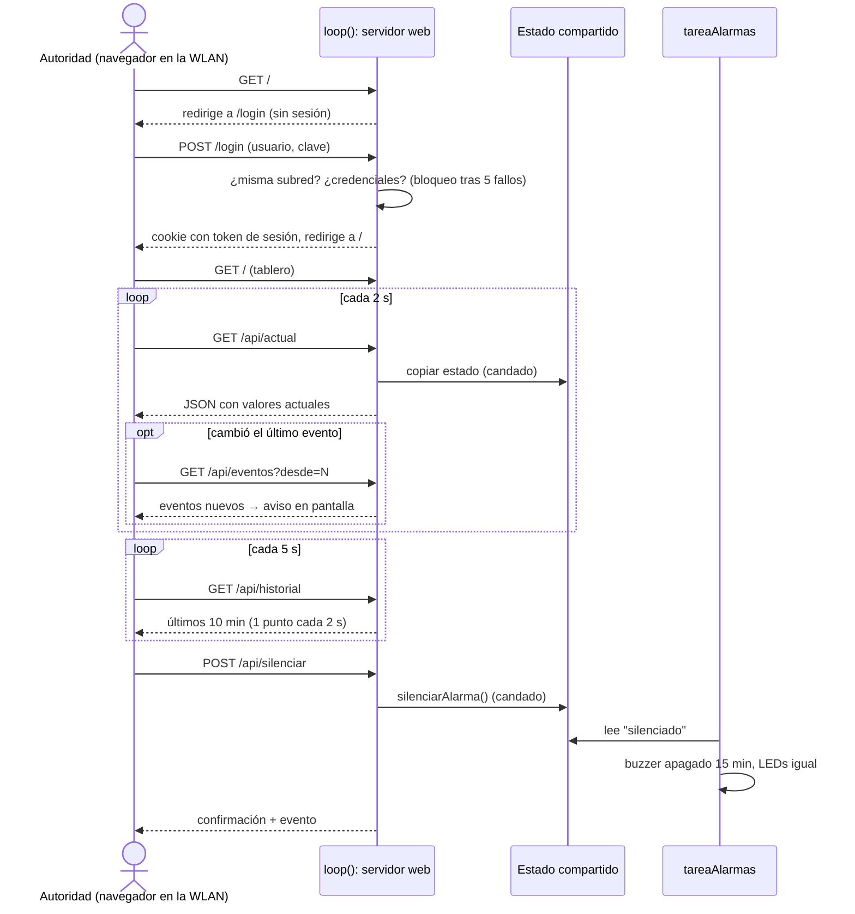
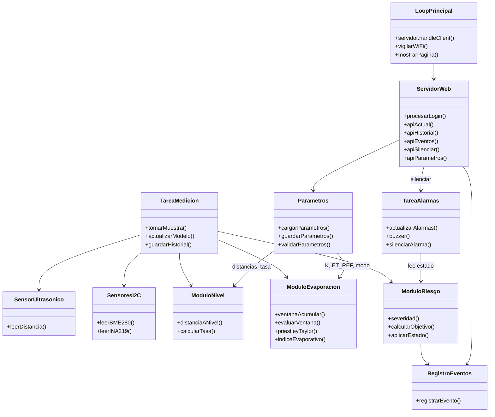

[⬅ Volver al índice](00-Home.md)

# 3. Desarrollo teórico modular

## 3.1 Criterios de diseño establecidos

| Criterio | Decisión de diseño | Justificación |
|---|---|---|
| **Independencia de red** | Toda la lógica de decisión corre en el ESP32; no hay llamadas a servicios externos. El tablero del Challenge #2 solo publica lo que el equipo ya decidió | La alarma *in situ* funciona aunque la WLAN no esté disponible |
| **Medición en hilo propio (Ch. #2)** | Tres hilos de FreeRTOS: medición (núcleo 0), alarmas (núcleo 1) y servidor/LCD (`loop()`, núcleo 1) | Cumple la restricción del enunciado y evita que un navegador lento o una caída de la red congelen la alarma física |
| **Acceso restringido (Ch. #2)** | Misma subred que el equipo + sesión con usuario y contraseña | Solo dispositivos autorizados y conectados a la WLAN de la zona ven los datos o actúan sobre la alarma |
| **Producto cerrado (Ch. #2)** | Calibración desde el tablero, guardada en la flash del ESP32 | La carcasa no se abre para ajustar el equipo en el sitio |
| **Trazabilidad de los parámetros (Ch. #2)** | Cada constante del modelo cita su fuente en el código y en la Sección 7.5; las que no tienen fuente se declaran como supuesto | Responde a la observación del Challenge #1 de que los valores no se anclaban a literatura ni normativa |
| **Modularidad funcional** | El firmware se organiza por responsabilidades: lectura de sensores, cálculo de nivel, VPD, índice evaporativo, tasa de descenso, riesgo y actuación | Facilita mantenimiento, depuración y reemplazo de sensores |
| **Múltiples señales, una decisión** | El riesgo hídrico depende de la fusión de nivel, condiciones evaporativas y tendencia | Responde a la necesidad de combinar múltiples señales para una alerta más completa |
| **Ninguna variable crítica queda oculta por el promedio** | Se incorporan reglas de seguridad independientes al promedio ponderado | Reduce el riesgo de falsos negativos ante condiciones individuales extremas |
| **Calibración simple** | El nivel se ajusta mediante parámetros de distancia correspondientes a lleno y vacío (en el Challenge #2, desde el tablero) | Permite adaptar el sistema a distintas geometrías |
| **Simulación antes del montaje físico** | Se validó inicialmente la arquitectura y lógica en Wokwi | Redujo errores antes de integrar sensores reales |
| **Validación física posterior** | El sistema fue implementado sobre una maqueta funcional | Permite verificar sensores, actuadores y comportamiento real del sistema |
| **Legibilidad para usuarios no técnicos** | LCD 16×2 I²C + LEDs semafóricos + buzzer | Facilita la interpretación local del estado |
| **Enfoque en la problemática hídrica** | El nivel y su tendencia son las variables principales; la presión se mantiene como contexto | Mantiene la lógica alineada con el riesgo de disponibilidad y desabastecimiento |

---

## 3.2 Modelo matemático de fusión de datos

### 3.2.1 Nivel del reservorio

El porcentaje de nivel se calcula a partir de la distancia medida por el sensor ultrasónico:

```text
Nivel (%) =
100 × (D_vacío - D_medida)
      ----------------------
      (D_vacío - D_lleno)
```

El resultado se limita al rango:

```text
0 % ≤ Nivel ≤ 100 %
```

En la implementación física, `D_lleno` y `D_vacío` corresponden a la calibración real de la maqueta.

---

### 3.2.2 Déficit de presión de vapor — VPD

La temperatura y la humedad relativa permiten calcular el déficit de presión de vapor.

De forma general:

```text
e_s = presión de vapor de saturación
e_a = presión de vapor actual

VPD = e_s - e_a
```

El VPD representa la capacidad del aire para aceptar vapor de agua adicional.

Un valor mayor indica condiciones más favorables para la evaporación.

---

### 3.2.3 Índice evaporativo

> **Challenge #2:** el índice del Challenge #1 (50 % irradiancia normalizada + 50 % VPD normalizado, con un factor de altitud sobre la irradiancia) se reemplazó por la **evaporación potencial diaria de Priestley-Taylor** [5] con los parámetros de **FAO-56** [6]. El reparto 50/50 no tenía respaldo en la literatura; el modelo nuevo sí, y además usa la presión medida en vez de un factor fijo.

#### Ecuación de Priestley-Taylor

```text
λ·ET = α · Δ/(Δ+γ) · (Rn − G)        [MJ/m²·día]
ET   = λ·ET / λ                       [mm/día]
```

Es una simplificación de Penman que conserva el término radiativo y reemplaza el aerodinámico por el coeficiente α. Rosenberry et al. [7] compararon 15 métodos en un lago de montaña contra el balance de energía, y Priestley-Taylor quedó entre los tres mejores (error medio de 0.19 mm/día).

#### Cálculo, en el orden del firmware

Con los promedios de una ventana móvil de mediciones (T media, Tmax, Tmin, HR media, P media):

| # | Magnitud | Fórmula | Fuente |
|---|---|---|---|
| 1 | Presión de vapor de saturación | `es(T) = 0.6108 · exp(17.27·T / (T + 237.3))` | [6] ec. 11 |
| 2 | Pendiente de la curva de saturación | `Δ = 4098 · es(T) / (T + 237.3)²` | [6] ec. 13 |
| 3 | Constante psicrométrica, con la **presión medida** | `γ = 0.000665 · P` | [6] ec. 8 |
| 4 | Presión de vapor real | `ea = (HR/100) · (es(Tmax) + es(Tmin)) / 2` | [6] ec. 19 |
| 5 | Radiación de cielo despejado | `Rso = (0.75 + 2·10⁻⁵ · z) · Ra` | [6] ec. 37 |
| 6 | Relación de nubosidad | `r = Rs / Rso`, limitada entre 0.3 y 1.0 | [6] (máximo); el mínimo es supuesto propio |
| 7 | Onda corta neta | `Rns = (1 − a) · Rs` | [6] ec. 38 |
| 8 | Onda larga neta | `Rnl = σ · (Tmax,K⁴ + Tmin,K⁴)/2 · (0.34 − 0.14·√ea) · (1.35·r − 0.35)` | [6] ec. 39 |
| 9 | Radiación neta | `Rn = max(Rns − Rnl, 0)` | [6] |
| 10 | Flujo de calor almacenado | `G = 0` a escala diaria | [6] ec. 42 (supuesto en agua) |
| 11 | Evaporación potencial | `ET = α · Δ/(Δ+γ) · Rn / λ` | [5] |

#### Constantes

| Constante | Valor | Fuente / estado |
|---|---|---|
| α (Priestley-Taylor) | 1.26 | [5], superficie de agua libre sin advección. Seleshi [14] encontró 1.11 en trópico de altura; se deja configurable y su calibración en el embalse es trabajo futuro |
| Albedo del agua `a` | 0.06 | [8]; Xiao et al. [12] midieron 0.041 y 0.079 |
| Calor latente λ | 2.45 MJ/kg | [6] |
| σ (Stefan-Boltzmann) | 4.903·10⁻⁹ MJ·K⁻⁴·m⁻²·día⁻¹ | [6] ec. 39 |
| Altitud `z` | 2560 m | Sitio; **solo** se usa en Rso. γ usa la presión medida |
| Radiación extraterrestre Ra | 36 MJ/m²·día, fija | [6] ec. 21 y anexo 2. A ~5° N varía entre ~33.5 y ~37.5: error < 3 % en ET sin necesidad de fecha ni reloj |
| Constante del panel K | 10 (W/m²)/mA | Etiqueta del panel (100 mA a 1000 W/m²) [9], [10]. **Pendiente de calibrar con sol** |

#### Ventana móvil y modos

El modelo es válido a escala diaria [5], [6]. La energía de radiación y los promedios de T, HR y P se acumulan en una ventana móvil de 24 *buckets* (no se guarda cada muestra: 24 h a 1 Hz serían 86 400 muestras).

- **Modo campo:** ventana de 24 h reales. `Rs_día = energía acumulada · 86 400 / tiempo cubierto`.
- **Modo demo:** ventana corta (120 s por defecto) cuyo promedio de luz se toma como **el mediodía de un día con esa nubosidad**, mediante el índice de claridad: `Rs_día = min(G / G_pico, 1) · Rso`, con `G_pico = π · Rso / (2 · 12 h) ≈ 1049 W/m²`, la irradiancia de un mediodía despejado del sitio para un día senoidal de 12 h. Una primera versión extrapolaba la ventana corta a 24 h iguales; con sol real (831 W/m²) eso daba 72 MJ/m² "por día", 2.5 veces el máximo físico, y el índice se saturaba siempre (ver [Sección 7.2](07-Conclusiones-Trabajo-Futuro.md)).
- Mientras la ventana esté cubierta en menos del 50 %, el estado de la evaporación es `CALCULANDO`: el índice vale 0 y no dispara reglas. En el tablero se muestra como "estimación en curso".

#### Índice evaporativo (0–100)

```text
Índice_evap = 70 · min(ET / ET_REF, 1) + 30 · min(VPD / VPD_REF, 1)
ET_REF  = 7.5 mm/día   (ET de un día despejado del sitio con este mismo modelo)
VPD_REF = 2.0 kPa      (supuesto: tarde seca del percentil alto de la Sabana)
VPD     = (es(Tmax) + es(Tmin))/2 − ea   ([6] ec. 12), promedio de la ventana
```

- **ET_REF** sale del propio modelo con Rs = Rso, T = 16 °C (22/8 °C), HR = 65 %, P = 75 kPa: Rn = 20.8 MJ/m²·día, Δ/(Δ+γ) = 0.699, ET = 7.48 mm/día. Así el 100 % de la parte de Priestley-Taylor es la demanda evaporativa máxima posible del sitio, sin traer un número de afuera.
- **El componente de VPD (30 %)** se justifica con Jansen et al. [11]: en un embalse grande, a escala de horas y días la evaporación sigue sobre todo al gradiente de vapor y al viento, que Priestley-Taylor no ve. El peso de 0.3 es el reparto aerodinámico de Penman γ/(Δ+γ) [6] a 16 °C y 75 kPa. Como α ya incluye en promedio la parte aerodinámica, el VPD se lee como señal de variación diaria, no como una evaporación que se suma. WREWS no mide viento ni temperatura del agua, así que el VPD del aire es una aproximación.
- **El VPD es el de la ventana**, no el de un instante: así queda en la misma escala de tiempo que ET y no salta con cada pico de mediodía.

Este índice:

> **No representa el porcentaje de agua que se evapora.**

Representa, en una escala relativa, qué tan favorables son las condiciones ambientales para la evaporación, normalizado contra un día despejado del propio sitio.

**Papel de la presión atmosférica.** La presión no se emplea como indicador de riesgo: en una estación fija de la región tropical su variación es de apenas un par de hectopascales sobre una presión de fondo de ~745 hPa, y no cambia cuando hay desabastecimiento. Sí participa como **parámetro del modelo de evaporación**, a través de la constante psicrométrica `γ = 0.665·10⁻³·P`, que determina el reparto entre el término radiativo y el aerodinámico. En el Challenge #2 entra directamente en Δ/(Δ+γ) con la presión medida por el BME280; el factor de altitud fijo del Challenge #1 se eliminó.

**Papel de la humedad en Priestley-Taylor.** La humedad solo entra al término radiativo a través de `ea` en Rnl, con un efecto pequeño (≈ 3 % al bajar la HR de 75 a 50 %). Sin luz, Rn = 0 y la parte de Priestley-Taylor vale 0 por mucho calor que haga: en esas condiciones el índice solo puede llegar a 30 por el componente de VPD. Esto se observó en las pruebas con secador sin luz sobre el panel (Sección 5.7).

**Supuestos declarados:**

1. Superficie de agua libre sin efecto oasis [5]: se cumple en un embalse; el banco de pruebas no lo cumple y solo valida la cadena de cálculo, no el valor absoluto de evaporación.
2. G ≈ 0 a escala diaria: [6] lo justifica para suelo; para agua profunda, Jansen et al. [11] y Xiao et al. [12] advierten que el calor almacenado no es despreciable.
3. Rnl de FAO-56, calibrada para tierra, aplicada sobre agua: aproximación habitual.
4. Ra fijo: error < 3 % en ET.
5. Modo demo: supone una forma de día típica de 12 h; no reemplaza la ventana de 24 h de campo.

---

### 3.2.4 Tasa e índice de descenso

La primera versión del sistema estimaba la tendencia restando dos mediciones consecutivas de nivel. Ese método resultó inviable ya que con el ruido del sensor la tasa superaba por mucho el umbral crítico, incluso con la plataforma quieta.

La versión final estima la pendiente por **regresión lineal por mínimos cuadrados** sobre una ventana de las últimas 20 mediciones. La regresión promedia el ruido de todas las muestras en vez de depender de dos.

```text
Tasa (pp/min) = − pendiente de la recta ajustada a los pares (tiempo, nivel) de la ventana
```

Cuando el nivel sube, la pendiente se trunca a cero: una recarga no constituye riesgo hídrico.

**Banda muerta.** Por debajo de un umbral derivado del ruido medido del propio sensor, la pendiente se fuerza a cero. Ese umbral se calcula automáticamente en cada arranque (ver Sección 5).

**Discontinuidades.** Un reservorio real no cambia de nivel de forma instantánea. Variaciones superiores a 8 puntos porcentuales entre mediciones consecutivas se interpretan como recarga del reservorio —o, en la maqueta, como reposicionamiento manual de la plataforma— y descartan el historial acumulado de tendencia. Sin este tratamiento, la regresión ajustada sobre un escalón produce una pendiente que crece por sí sola mientras el escalón avanza por la ventana.

**Precauciones numéricas.** El eje temporal se expresa relativo a la muestra más antigua de la ventana. Usando el tiempo absoluto del sistema en punto flotante, los términos del denominador de la regresión se aproximan entre sí y su diferencia se pierde por cancelación a los pocos minutos de encendido.

### 3.2.5 Riesgo hídrico

El riesgo general se calcula mediante:

```text
Riesgo =
0.54 × Déficit de nivel
+
0.30 × Índice evaporativo
+
0.16 × Índice de descenso
```

La mayor ponderación corresponde al nivel porque representa directamente la disponibilidad actual de agua.

**Origen de los pesos (Challenge #2).** No existe una fuente que fije "el nivel pesa 50 %"; lo que sí existe es un método citado para derivar pesos de criterio experto: el **Proceso Analítico Jerárquico (AHP)** de Saaty [18], el más usado para construir índices compuestos de sequía [19]. Se compararon las tres señales por pares en la escala 1–9 de Saaty:

| | Nivel | Evaporación | Tasa |
|---|---|---|---|
| **Nivel** | 1 | 2 | 3 |
| **Evaporación** | 1/2 | 1 | 2 |
| **Tasa** | 1/3 | 1/2 | 1 |

El nivel es "levemente más importante" que la evaporación y "moderadamente más importante" que la tasa, y la evaporación es levemente más importante que la tasa: el nivel es la variable de estado, la evaporación es el forzante dominante en El Niño y la tasa es la señal más ruidosa de las tres. El vector de pesos resultante es **54 / 30 / 16 %**, con una razón de consistencia **CR = 0.008** (< 0.10, el límite de Saaty). Los 50/30/20 del Challenge #1 eran prácticamente ese mismo vector redondeado.

---

### 3.2.6 Reglas de clasificación de estado

La lógica de clasificación incorpora el índice ponderado y reglas de seguridad.

| Estado | Condición general |
|---|---|
| 🔴 **CRÍTICO** | Riesgo elevado o alguna variable individual alcanza un umbral crítico (excepto la evaporación, ver abajo) |
| 🟡 **PRECAUCIÓN** | Riesgo intermedio o alguna variable supera su umbral de advertencia |
| 🟢 **NORMAL** | Ninguna condición de precaución o crítica está activa |

La implementación utiliza umbrales definidos en el firmware para:

- nivel;
- índice evaporativo;
- tasa de descenso;
- riesgo combinado.

Estos valores corresponden a parámetros iniciales de diseño y pueden recalibrarse para una instalación real.

**La evaporación sola lleva como máximo a PRECAUCIÓN (Challenge #2).** El estado es la peor severidad de nivel, tasa y riesgo, y de la evaporación limitada a precaución. La evaporación es un forzante, no la disponibilidad de agua: con el embalse lleno, un mediodía seco y soleado no es una emergencia, y dejar que disparara CRÍTICO producía falsos positivos (se observó en las pruebas al sol, Sección 5.7). Su severidad completa se sigue reportando en el tablero ("demanda extrema") y entra al riesgo con su peso del 30 %: con el nivel bajo, el riesgo combinado sí lleva a CRÍTICO.

---

### 3.2.7 Umbrales aplicados

| Variable | PRECAUCIÓN | CRÍTICO | Origen del valor |
|---|---|---|---|
| Nivel del reservorio | ≤ 50 % | ≤ 15 % | Fases de los Planes Especiales de Sequía de España [20], [21] (prealerta 0.50, emergencia 0.15); caso Chingaza 2024, racionamiento con el sistema en 16.5 % [22] |
| Índice evaporativo | ≥ 60 | ≥ 85 (solo como severidad; el estado llega como máximo a PRECAUCIÓN) | **Supuesto.** El 100 % tiene base física (ET_REF); 60 y 85 deben cerrarse con los percentiles 80 y 95 de una estación del IDEAM, método del US Drought Monitor [23] |
| Tasa de descenso | ≥ 33 pp/min | ≥ 68 pp/min | **Calibración experimental** (Sección 5); editables desde el tablero |
| Riesgo ponderado | ≥ 36.2 | ≥ 69.2 | Derivados de los de nivel, al estilo de los indicadores por fases como el CDI europeo [24] |

**Derivación de los umbrales de riesgo.** No hay literatura para el número exacto porque el índice es propio; se derivan de los umbrales de nivel, que sí están citados:

```text
PRECAUCIÓN = 0.54·(100 − 50) + 0.30·20 + 0.16·20 = 36.2   (nivel en precaución, el resto en reposo)
CRÍTICO    = 0.54·(100 − 15) + 0.30·60 + 0.16·33 = 69.2   (nivel en crítico, el resto en su precaución)
```

**Mapeo de las fases de los PES a los estados de WREWS:**

| Fase en los PES | Índice | Estado WREWS |
|---|---|---|
| Normalidad | > 0.50 | NORMAL |
| Prealerta y alerta | 0.50 a 0.15 | PRECAUCIÓN |
| Emergencia | ≤ 0.15 | CRÍTICO |

Limitación declarada: el índice de los PES es el volumen normalizado contra la historia del propio embalse, no exactamente el porcentaje de llenado; para el prototipo es una aproximación razonable.

Referencias de normalización del índice evaporativo: ET_REF = 7.5 mm/día y VPD_REF = 2.0 kPa (Sección 3.2.3). La de VPD se fijó a partir del clima local: a 24 °C la presión de vapor de saturación es 2.98 kPa, de modo que 2.0 kPa representa una tarde seca del percentil alto de la región. Una referencia mayor dejaría el índice permanentemente por debajo de sus umbrales.

Los umbrales de tasa corresponden al banco de pruebas, donde la plataforma se desplaza manualmente en segundos. No deben interpretarse como límites hidrológicos de un reservorio real: en campo, con una escala temporal de horas, los valores equivalentes serían del orden de 0.03 y 0.08 pp/min.

### 3.2.8 Escalera de estados y confirmación temporal

Las transiciones se producen de un nivel a la vez, incluso cuando las condiciones instantáneas corresponden a un estado dos escalones por encima. Así PRECAUCIÓN es siempre observable, lo que permite anticipar la escalada y deja el historial completo en el registro.

La confirmación es **asimétrica**: dos ciclos consecutivos para escalar y tres para desescalar. Los costos de los dos errores posibles no son equivalentes: alertar tarde en un evento de desabastecimiento puede impedir la respuesta, mientras que sostener una alerta unos segundos de más no tiene costo operativo. La banda muerta, los retardos de confirmación y la escalera de estados son prácticas de gestión de alarmas industriales: la norma ANSI/ISA-18.2 exige que el sistema soporte banda muerta y retardos [16], y EEMUA 191 da valores de referencia para la banda muerta [17].

El estado **FALLO** no participa de la escalera. No es un nivel de riesgo sino una condición del equipo —ausencia de eco del ultrasónico, o del BME280 en el bus I²C— y se entra y se sale de forma directa. Su señalización, los tres LEDs parpadeando a la vez, no se confunde con ningún estado operativo: un sistema de alerta que enmudece cuando pierde un sensor es la peor falla posible.

## 3.3 Diagramas UML

Diagramas actualizados al firmware v7 del Challenge #2 (`firmware/wrews/wrews.ino` y `tablero.h`).

### 3.3.1 Diagrama de estados


```mermaid
stateDiagram-v2
    [*] --> NORMAL

    NORMAL --> PRECAUCION: condición de advertencia\n(confirmada 2 ciclos)
    PRECAUCION --> CRITICO: condición crítica\n(confirmada 2 ciclos)
    CRITICO --> PRECAUCION: riesgo disminuye\n(confirmado 3 ciclos)
    PRECAUCION --> NORMAL: condiciones mejoran\n(confirmado 3 ciclos)

    NORMAL --> FALLO: sin eco o sin BME280
    PRECAUCION --> FALLO: sin eco o sin BME280
    CRITICO --> FALLO: sin eco o sin BME280
    FALLO --> NORMAL: sensores de vuelta

    state NORMAL {
        [*] --> LED_Verde
        LED_Verde: LED verde fijo
        LED_Verde: buzzer apagado
    }

    state PRECAUCION {
        [*] --> LED_Amarillo
        LED_Amarillo: LED amarillo fijo
        LED_Amarillo: buzzer 1000 Hz, 150 ms cada 4 s
    }

    state CRITICO {
        [*] --> LED_Rojo
        LED_Rojo: LED rojo parpadeando
        LED_Rojo: buzzer 2000 Hz, 250 ms cada 1.2 s
    }

    state FALLO {
        [*] --> Tres_LEDs
        Tres_LEDs: los tres LEDs parpadeando
        Tres_LEDs: buzzer 600 Hz, 120 ms cada 3 s
    }
```

Se sube y se baja de a un peldaño: de NORMAL nunca se salta directo a CRÍTICO, así PRECAUCIÓN siempre es observable. En cualquier estado, el silencio desde el tablero calla solo el buzzer durante 15 min; si el estado empeora, el silencio se cancela.

---

### 3.3.2 Diagrama de secuencia — ciclo de medición


```mermaid
sequenceDiagram
    participant TM as tareaMedicion (núcleo 0)
    participant ULTRA as HC-SR04
    participant I2C as Bus I²C (mtx_i2c)
    participant EST as Estado compartido (mtx_estado)
    participant TA as tareaAlarmas (núcleo 1)
    participant ACT as LEDs / Buzzer

    loop cada 1 s (vTaskDelayUntil)
        TM->>ULTRA: 5 pulsos TRIG, mediana de 5 ecos
        ULTRA-->>TM: distancia
        TM->>I2C: tomar bus
        TM->>I2C: leer BME280 (T, HR, P) e INA219 (corriente)
        TM->>I2C: liberar bus
        TM->>EST: tomar candado
        TM->>TM: nivel, tasa (regresión), ventana de evaporación,<br/>Priestley-Taylor, índice, riesgo
        TM->>TM: clasificar y aplicar escalera de estados
        TM->>TM: registrar eventos e historial
        TM->>EST: liberar candado
    end

    loop cada 10 ms
        TA->>EST: copiar estado y silencio
        TA->>ACT: patrón de LEDs y buzzer
    end
```

La lectura del HC-SR04 (~100 ms) se hace **antes** de tomar el candado del estado, para no frenar las alarmas. El orden de los candados es fijo (nunca se toma el del bus teniendo el del estado), lo que evita bloqueos mutuos.

---

### 3.3.3 Diagrama de secuencia — tablero de control


```mermaid
sequenceDiagram
    actor U as Autoridad (navegador en la WLAN)
    participant SRV as loop(): servidor web
    participant EST as Estado compartido
    participant TA as tareaAlarmas

    U->>SRV: GET /
    SRV-->>U: redirige a /login (sin sesión)
    U->>SRV: POST /login (usuario, clave)
    SRV->>SRV: ¿misma subred? ¿credenciales? (bloqueo tras 5 fallos)
    SRV-->>U: cookie con token de sesión, redirige a /
    U->>SRV: GET / (tablero)

    loop cada 2 s
        U->>SRV: GET /api/actual
        SRV->>EST: copiar estado (candado)
        SRV-->>U: JSON con valores actuales
        opt cambió el último evento
            U->>SRV: GET /api/eventos?desde=N
            SRV-->>U: eventos nuevos → aviso en pantalla
        end
    end

    loop cada 5 s
        U->>SRV: GET /api/historial
        SRV-->>U: últimos 10 min (1 punto cada 2 s)
    end

    U->>SRV: POST /api/silenciar
    SRV->>EST: silenciarAlarma() (candado)
    TA->>EST: lee "silenciado"
    TA->>TA: buzzer apagado 15 min, LEDs igual
    SRV-->>U: confirmación + evento
```

---

### 3.3.4 Diagrama de componentes de software


```mermaid
classDiagram

    class TareaMedicion {
        +tomarMuestra()
        +actualizarModelo()
        +guardarHistorial()
    }

    class SensorUltrasonico {
        +leerDistancia()
    }

    class SensoresI2C {
        +leerBME280()
        +leerINA219()
    }

    class ModuloNivel {
        +distanciaANivel()
        +calcularTasa()
    }

    class ModuloEvaporacion {
        +ventanaAcumular()
        +evaluarVentana()
        +priestleyTaylor()
        +indiceEvaporativo()
    }

    class ModuloRiesgo {
        +severidad()
        +calcularObjetivo()
        +aplicarEstado()
    }

    class TareaAlarmas {
        +actualizarAlarmas()
        +buzzer()
        +silenciarAlarma()
    }

    class LoopPrincipal {
        +servidor.handleClient()
        +vigilarWiFi()
        +mostrarPagina()
    }

    class ServidorWeb {
        +procesarLogin()
        +apiActual()
        +apiHistorial()
        +apiEventos()
        +apiSilenciar()
        +apiParametros()
    }

    class Parametros {
        +cargarParametros()
        +guardarParametros()
        +validarParametros()
    }

    class RegistroEventos {
        +registrarEvento()
    }

    TareaMedicion --> SensorUltrasonico
    TareaMedicion --> SensoresI2C
    TareaMedicion --> ModuloNivel
    TareaMedicion --> ModuloEvaporacion
    TareaMedicion --> ModuloRiesgo
    ModuloRiesgo --> RegistroEventos
    TareaAlarmas --> ModuloRiesgo : lee estado
    LoopPrincipal --> ServidorWeb
    ServidorWeb --> RegistroEventos
    ServidorWeb --> TareaAlarmas : silenciar
    ServidorWeb --> Parametros
    Parametros --> ModuloNivel : distancias, tasa
    Parametros --> ModuloEvaporacion : K, ET_REF, modo
```

---

## 3.4 Arquitectura física

La versión final presentada utiliza los siguientes componentes:

```text
                 ┌───────────────┐
                 │     ESP32     │
                 │ procesamiento │
                 └───────┬───────┘
                         │
       ┌─────────────────┼──────────────────┐
       │                 │                  │
       ▼                 ▼                  ▼
Sensor ultrasónico     BME280        Panel + INA219
Nivel                  T / HR / P     Irradiancia aprox.

                         │
                         ▼
                 Procesamiento local
                         │
                         ▼
              NORMAL / PRECAUCIÓN /
                     CRÍTICO
                         │
          ┌──────────────┼──────────────┬──────────────────┐
          ▼              ▼              ▼                  ▼
      LCD 16×2         LEDs           Buzzer     Wi-Fi → tablero web
                                                 (WLAN de la zona)
```

La simulación original de Wokwi se conserva en la carpeta `/hardware/wokwi` como evidencia del proceso de diseño previo. Corresponde al firmware del Challenge #1; el firmware v7 (tareas de FreeRTOS, Wi-Fi y servidor web) se validó directamente sobre el hardware.

El hardware físico final utiliza una LCD 16×2 I²C como interfaz local.

---

## 3.5 Comunicación I²C

El sistema aprovecha el bus I²C para conectar varios módulos al ESP32.

Los dispositivos principales son:

| Dispositivo | Interfaz | Dirección |
|---|---|---|
| BME280 | I²C | `0x76` |
| INA219 | I²C | `0x40` |
| LCD 16×2 | I²C | `0x27` |

El firmware escanea el bus al arrancar e identifica cada dispositivo por su dirección; si falta el BME280 el equipo pasa a FALLO, y si falta el INA219 la irradiancia se toma como 0.

El bus utiliza las líneas:

```text
SDA
SCL
```

compartidas entre los dispositivos.

Cada módulo utiliza una dirección propia, permitiendo que el ESP32 pueda comunicarse con varios periféricos sobre el mismo bus.

En el Challenge #2 el bus lo usan dos hilos distintos: la tarea de medición (BME280 e INA219) y `loop()` (LCD). Un mutex (`mtx_i2c`) garantiza que nunca haya dos transacciones I²C a la vez.

---

## 3.6 Sensor ultrasónico

El sensor ultrasónico utiliza dos señales digitales:

```text
TRIG
ECHO
```

El ESP32 genera un pulso sobre `TRIG`.

El sensor responde mediante `ECHO`, cuya duración permite estimar la distancia.

De manera simplificada:

```text
ESP32
  │
  ├── TRIG ──→ Sensor
  │
  └── ECHO ←── Sensor
```

Esta distancia se transforma posteriormente en porcentaje de nivel.

---

## 3.7 Pantalla LCD 16×2 I²C

La interfaz física final utiliza una pantalla LCD 16×2 con adaptador I²C.

La pantalla cumple dos funciones principales:

1. presentar información relevante del sistema;
2. mostrar al usuario el estado de riesgo.

Debido a la limitación de 16 caracteres por 2 filas, la interfaz prioriza la información esencial y organiza las variables en diferentes vistas o ciclos de actualización.

El procesamiento de todas las variables continúa realizándose internamente en el ESP32 aunque no todas se muestren simultáneamente.

En el firmware v7 la LCD rota entre siete páginas cada 2.5 s; la séptima muestra el estado del Wi-Fi y la **IP del tablero**, que es como el usuario sabe a qué dirección entrar (el detalle de las páginas está en la [Sección 2.14](02-Solucion-Propuesta.md)).

---

## 3.8 LEDs y buzzer

Los LEDs utilizan una codificación semafórica:

```text
Verde     → NORMAL
Amarillo  → PRECAUCIÓN
Rojo      → CRÍTICO
```

El buzzer actúa como alarma sonora adicional en el estado crítico.

En el firmware v7 cada estado tiene su patrón, para que se reconozca sin mirar el equipo:

| Estado | LEDs | Buzzer |
|---|---|---|
| NORMAL | Verde fijo | Apagado |
| PRECAUCIÓN | Amarillo fijo | 1000 Hz, 150 ms cada 4 s |
| CRÍTICO | Rojo parpadeando (200 ms cada 400 ms) | 2000 Hz, 250 ms cada 1.2 s |
| FALLO | Los tres parpadeando | 600 Hz, 120 ms cada 3 s |

Los LEDs son de ánodo común (se encienden en `LOW`). El buzzer es **pasivo** y se maneja con PWM (LEDC). La frecuencia del PWM se cambia solo cuando cambia el estado, y cada pitido se enciende y apaga con el ciclo útil (50 % / 0 %), que no reinicia la onda. El tono de crítico es de **2000 Hz** porque un barrido de 500 a 4000 Hz mostró que el buzzer del prototipo no suena desde 2500 Hz (Sección 5.7).

El silencio desde el tablero apaga **solo el buzzer** durante 15 minutos: los LEDs siguen mostrando el estado, porque la condición de riesgo no desaparece porque alguien la reconozca.

Esto proporciona dos mecanismos de notificación:

```text
VISUAL
LCD + LEDs

SONORO
Buzzer
```

---

## 3.9 Diseño de la maqueta

Para validar el sensor de nivel se construyó una maqueta con una plataforma móvil.

La plataforma representa la superficie del agua.

```text
Plataforma arriba
       ↓
Distancia pequeña
       ↓
Nivel alto

Plataforma abajo
       ↓
Distancia grande
       ↓
Nivel bajo
```

Esta solución permitió:

- controlar la distancia;
- repetir escenarios;
- observar las transiciones de estado;
- evitar contacto entre agua y electrónica;
- acelerar las pruebas durante la validación.

---

## 3.10 Estrategia de simulación

Antes del montaje físico se desarrolló una versión funcional en Wokwi.

La simulación permitió:

- validar el sensor ultrasónico;
- comprobar el bus I²C;
- simular temperatura, humedad y presión;
- simular el panel y el INA219;
- probar la lógica matemática;
- modificar las variables mediante controles;
- verificar NORMAL, PRECAUCIÓN y CRÍTICO.

En Wokwi se utilizaron *custom chips* para representar componentes que requerían comportamiento configurable.

La simulación original utiliza una pantalla OLED como componente virtual. Posteriormente, durante la implementación física, esta interfaz fue reemplazada por una **LCD 16×2 I²C** disponible para el equipo.

Este cambio no modifica la arquitectura lógica del sistema: ambos dispositivos cumplen la función de visualización local mediante I²C.

---

## 3.11 Estrategia de implementación física

Después de validar la lógica en simulación se integró el prototipo físico.

El proceso general fue:

```text
Prueba del ESP32
      ↓
Sensor ultrasónico
      ↓
LCD + buzzer
      ↓
BME280
      ↓
Panel + INA219
      ↓
LEDs
      ↓
Integración completa
      ↓
Calibración
      ↓
Pruebas de estados
```

Durante esta etapa se realizaron ajustes propios del hardware real, especialmente relacionados con:

- calibración de distancia;
- estabilidad de las lecturas;
- bus I²C;
- actuación de LEDs;
- comportamiento del buzzer;
- organización de la información en la LCD.

---

## 3.12 Estándares y buenas prácticas de ingeniería

| Estándar / práctica | Aplicación |
|---|---|
| **I²C** | Comunicación entre ESP32, BME280, INA219 y LCD |
| **UML** | Modelado de estados, secuencia y componentes |
| **Codificación semafórica** | Verde = normal, amarillo = precaución, rojo = crítico |
| **Diseño modular** | Separación de lectura, procesamiento, fusión y actuación |
| **Validación progresiva** | Simulación antes de implementación física |
| **Reglas de seguridad** | Condiciones críticas individuales pueden prevalecer sobre el promedio |
| **Procesamiento local** | El sistema no depende de servicios externos para generar alertas |
| **Calibración** | Los parámetros del nivel se ajustan a la geometría del sistema evaluado |
| **FAO-56 (Allen et al.) [6] y Priestley-Taylor [5]** | Ecuaciones de radiación neta, Δ, γ y evaporación potencial (Ch. #2) |
| **AHP de Saaty [18]** | Derivación de los pesos 54/30/16 del riesgo (Ch. #2) |
| **Planes Especiales de Sequía — Orden TEC/1399/2018 [20], [21]** | Umbrales de nivel de 50 % y 15 % (Ch. #2) |
| **ANSI/ISA-18.2 [16] y EEMUA 191 [17]** | Gestión de alarmas: banda muerta, retardos de confirmación, escalera de estados y silencio sin ocultar el estado |
| **IEEE 802.11 (Wi-Fi) [29]** | Enlace del ESP32 a la WLAN de la zona, banda de 2.4 GHz (Ch. #2) |
| **HTTP/1.1 — RFC 9110 [30]** | Servidor web embebido y API JSON del tablero (Ch. #2) |
| **FreeRTOS / ESP-IDF [31]** | Tareas por núcleo, `vTaskDelayUntil` y mutex para el estado compartido (Ch. #2) |

---

## 3.13 Flujo completo del sistema

```text
SENSOR ULTRASÓNICO
        ↓
      NIVEL
        │
        │
        ├───────────────────────────┐
        │                           │
        ▼                           │
 DÉFICIT DE NIVEL                   │
      54 %                          │
                                    │
BME280                              │
T + HR + P                          │
  ↓                                 │
 VPD · Δ/(Δ+γ) ─┐                   │
                ├→ PRIESTLEY-TAYLOR │
PANEL           │  + VPD            │
  ↓             │  ÍNDICE EVAP. ───┤
INA219          │       30 %        │
  ↓             │                   │
IRRADIANCIA ────┘                   │
                                    ├→ RIESGO
NIVEL EN EL TIEMPO                  │
        ↓                           │
TASA DE DESCENSO ───────────────────┘
       16 %
        ↓
REGLAS DE SEGURIDAD
        ↓
NORMAL / PRECAUCIÓN / CRÍTICO
        ↓
LCD + LEDs + Buzzer   ·   tablero web en la WLAN
```

---

## 3.14 Concurrencia: medición en un hilo propio (Challenge #2)

El enunciado exige que la medición se ejecute desde una ISR o desde un hilo distinto al principal. El firmware v7 usa tres hilos de FreeRTOS [31]:

| Hilo | Núcleo | Prioridad | Periodo | Responsabilidad |
|---|---|---|---|---|
| `tareaMedicion` | 0 | 2 | 1 s (`vTaskDelayUntil`) | Lee los sensores, actualiza el modelo (nivel, tasa, evaporación, riesgo), decide el estado y guarda historial y eventos |
| `tareaAlarmas` | 1 | 2 | 10 ms | LEDs y buzzer |
| `loop()` | 1 | 1 | continuo | Servidor web, vigilancia del Wi-Fi y páginas del LCD |

- **Por qué las alarmas van aparte del servidor:** un navegador lento o una caída de la WLAN pueden bloquear `loop()` unos segundos; con las alarmas en su propia tarea, la alarma física no se congela nunca.
- **Estado compartido:** un mutex (`mtx_estado`) protege todas las variables que leen o escriben varios hilos. Las lecturas lentas de los sensores se hacen **fuera** del candado, que solo se toma para actualizar el estado.
- **Bus I²C:** un segundo mutex (`mtx_i2c`) evita que la tarea de medición y el LCD usen el bus al mismo tiempo.
- **Orden fijo de los candados** (nunca se toma el del bus teniendo el del estado), para que no haya bloqueos mutuos.
- **No se usan ISR:** las lecturas I²C y los cálculos en coma flotante no deben ejecutarse dentro de una rutina de interrupción.

---

## 3.15 Conectividad: Wi-Fi en modo estación (Challenge #2)

- **Modo estación (STA):** el ESP32 se une a la WLAN que las autoridades ofrecen en la zona; en la demostración, el hotspot de un celular. No crea su propia red, de acuerdo con el enunciado.
- **Banda de 2.4 GHz** (IEEE 802.11 b/g/n [29]); el ESP32 no se conecta a redes de 5 GHz.
- **Una o dos redes configuradas.** El equipo se une a la que encuentre con mejor señal y, si una se cae, prueba con la otra. Los nombres y las claves van en `secrets.h`, que no se sube al repositorio (plantilla en `secrets.example.h`).
- **Sin ahorro de energía en el radio** (`WiFi.setSleep(false)`): con el ahorro activo, el ESP32 deja de escuchar entre paquetes y con hotspots de celular el tablero a veces no respondía. Aumenta el consumo (ver Sección 6.3).
- **Reconexión.** Si la red se cae, el ESP32 intenta reconectarse solo; si en 30 s no lo logra, el firmware reintenta. Al volver la red se reinician el servidor web y el anuncio mDNS, para que recargar la página o abrirla desde otro dispositivo funcione aunque el hotspot se haya reiniciado.
- **Dirección del tablero.** La IP la asigna la WLAN y se muestra en la página 7 del LCD. En un PC también funciona `http://wrews.local` (mDNS); en Android no. Si al reconectar la IP cambia, queda un evento en el tablero.
- **Eventos de red:** conexión (con el nombre de la red y la dirección del tablero), pérdida de la red y número de reconexiones, visibles en el tablero.

---

## 3.16 Tablero de control (Challenge #2)

El tablero es una página web servida por el propio ESP32 (`firmware/wrews/tablero.h`). No usa librerías externas ni CDN, porque la WLAN de la zona puede no tener salida a Internet: las gráficas se dibujan con `<canvas>`.

### Contenido

- **Estado general** (NORMAL, PRECAUCIÓN, CRÍTICO o FALLO) con su color, la severidad de cada variable y el botón **"Silenciar alarma 15 min"**.
- **Tarjetas con el valor actual:** nivel y distancia, tasa de descenso, índice evaporativo, riesgo hídrico, evaporación (mm/día) y radiación neta, irradiancia, temperatura, humedad, presión y VPD (instantáneo y de la ventana). El borde de cada tarjeta toma el color de su severidad.
- **Histórico reciente:** últimos 10 minutos (un punto cada 2 s) de nivel, riesgo, índice evaporativo, tasa, temperatura e irradiancia, con los umbrales de precaución y crítico punteados.
- **Eventos:** cambios de estado, silencios, pérdida y vuelta del Wi-Fi, inicios de sesión, claves incorrectas y cambios de configuración, con su antigüedad. Cada evento nuevo muestra un **aviso** en la parte superior, suena y vibra (después del primer toque en la página).
- **Encabezado y pie:** red, señal (dBm), antigüedad del último dato, tiempo encendido, reconexiones y modo.
- **Configuración y calibración** (Sección 3.17).

### API

| Método y ruta | Uso |
|---|---|
| `GET /` · `GET /login` · `POST /login` · `POST /logout` | Páginas del tablero y sesión |
| `GET /api/actual` | Valor actual de todas las variables (cada 2 s) |
| `GET /api/historial` | Últimos 300 puntos (cada 5 s) |
| `GET /api/eventos?desde=N` | Eventos nuevos (cuando cambia el último evento) |
| `GET /api/config` | Umbrales, pesos y modo, para dibujar las gráficas |
| `POST /api/silenciar` | Silencia el buzzer 15 min |
| `GET` y `POST /api/parametros` · `POST /api/parametros/restaurar` | Calibración |

Cada petición del navegador se cancela si no responde en 4 s (8 s para el historial), y no se lanza una nueva hasta que termina la anterior. Así, cuando la WLAN vuelve después de una caída, el tablero se recupera solo en pocos segundos en lugar de quedar en fila detrás de peticiones colgadas.

### Acceso restringido

El enunciado exige que solo dispositivos **autorizados** y **conectados a la WLAN de la zona** accedan al tablero. Se exigen las dos condiciones:

1. **Misma subred:** el servidor rechaza clientes cuya dirección no esté en la subred del equipo (respuesta 403).
2. **Sesión iniciada:** usuario y contraseña en `/login`. Al validarse, el equipo genera un **token aleatorio de 128 bits** (`esp_random`) que viaja en una cookie `HttpOnly` y `SameSite=Strict`, válida 12 h. Hay hasta 4 sesiones simultáneas; tras **5 claves incorrectas** el inicio de sesión se bloquea 30 s, y cada intento fallido queda como evento.

**Limitación declarada:** el tablero va por HTTP, sin TLS. La clave viaja una sola vez (al iniciar sesión) y solo la protege el cifrado WPA2 de la WLAN. Las sesiones se pierden si el equipo se reinicia.

---

## 3.17 Calibración desde el tablero (Challenge #2)

Los parámetros que dependen del sitio se editan desde la sección "Configuración y calibración" del tablero, se validan en el equipo y se guardan en la flash del ESP32 (`Preferences`/NVS): se conservan aunque el equipo se apague o se reprograme. Se aplican en caliente, sin reiniciar, y cada cambio queda como evento.

| Parámetro | De fábrica | Validación | Ayuda en el tablero |
|---|---|---|---|
| Distancia con el tubo lleno / vacío | 3 / 20 cm | lleno entre 2 y 300 cm; vacío al menos 2 cm mayor que lleno y hasta 400 cm | Muestra la distancia medida en vivo, con botones "Usar como lleno" y "Usar como vacío" |
| K del panel | 10 (W/m²)/mA | 0.5 a 100 | Con una irradiancia de referencia, "Calcular K" la divide por la corriente medida en ese momento |
| Tasa de precaución / crítico | 33 / 68 pp/min | precaución 0.5 a 1000; crítico mayor que precaución | — |
| Salto de discontinuidad | 8 pp | 1 a 100 | — |
| Modo | Demo | Demo o campo | — |
| Ventana demo | 120 s | 30 a 86 400 s | — |
| ET de referencia | 7.5 mm/día | 1 a 20 | — |

Si cambian las distancias, la tendencia de la tasa se reinicia (la escala del nivel cambió); si cambian el modo o la ventana, la estimación de evaporación vuelve a llenarse. Un botón restaura los valores de fábrica. **Los pesos y los umbrales de nivel, riesgo y evaporación no son editables**: están justificados con referencias y solo se cambian en el código.

---

## 3.18 Autodiagnóstico al arrancar (Challenge #2)

Al encender, y antes de empezar a operar, el firmware:

1. Prueba las salidas: LEDs en orden y los dos tonos de alarma (1000 y 2000 Hz).
2. Escanea el bus I²C e identifica LCD, BME280 e INA219.
3. Mide la **corriente del panel en reposo** (promedio de 20 lecturas) y la toma como cero del piranómetro **solo si es menor de 1 mA**; si es mayor, asume que hay luz sobre el panel y deja el cero en 0.
4. Caracteriza el **ruido del sensor de nivel** y calcula la banda muerta de la tasa (Sección 5.5.1).
5. Ejecuta **7 pruebas del modelo de evaporación** contra valores de referencia (Sección 5.7).
6. Carga la calibración guardada en la flash.

Todo queda en el monitor serial como evidencia.

---

## 3.19 Producto terminado: carcasa, alimentación e instalación (Challenge #2)

### Carcasa

Diseñada en CadQuery e impresa en PETG, en seis piezas: prueba de ajuste del tubo, acople al tubo, tapa, caja, piso intermedio y techo del BME280. La caja mide 136 × 110 × 73 mm (interior 130 × 104 × 70 mm). El BME280 va bajo un techo con rejillas, a la sombra y ventilado, como pide la buena práctica meteorológica para medir temperatura y humedad del aire. ⟨completar: versión final impresa, fotos y enlace a los STL⟩.

### Sensor de nivel en tubo

El HC-SR04 va dentro de un tubo de **PVC sanitario de 3"** (diámetro exterior ≈ 82.5 mm) de 40 a 50 cm, con corte recto, borde interior lijado y entradas de agua en la parte inferior. El tubo aísla la medición del oleaje y de reflexiones laterales. El agua no debe subir a menos de **5 cm** del sensor (zona ciega), por lo que la distancia de "lleno" se calibra a 5 cm o más.

### Alimentación

| Rama | Desde | Alimenta |
|---|---|---|
| Pilas | Portapilas 4×AA → interruptor | Pin `VIN` del ESP32 y fila de 5 V |
| 5 V | `VIN` | HC-SR04, buzzer, LEDs, LCD |
| 3.3 V | Pin `3V3` del ESP32 | BME280, INA219 |

⟨completar: tipo de pilas usado finalmente y, si son alcalinas (≈ 6 a 6.4 V nuevas), los 2 diodos 1N4007 en serie y la tensión medida en la fila de 5 V⟩. Para programar por USB, el interruptor va en OFF.

### Mapa de pines (ESP32 DevKit de 38 pines)

| Pin ESP32 | Conectado a | Función |
|---|---|---|
| `GPIO 21 (SDA)` · `GPIO 22 (SCL)` | BME280, INA219, LCD | Bus I²C |
| `GPIO 5` | TRIG del HC-SR04 | Disparo del pulso ultrasónico |
| `GPIO 18` | ECHO del HC-SR04 | Recepción del eco ⟨confirmar si lleva divisor resistivo⟩ |
| `GPIO 25` · `GPIO 26` · `GPIO 27` | LED verde · amarillo · rojo (ánodo común) | Estado |
| `GPIO 19` | Buzzer pasivo | Alarma sonora (PWM) |
| `VIN` · `3V3` · `GND` | Ver tabla de alimentación | Alimentación y tierra común |

En el Challenge #2 se retiró el botón físico de silencio del Challenge #1: el silencio se hace desde el tablero.

---

## 3.20 Trazabilidad Wiki ↔ código

Todos los valores de esta Wiki salen de `firmware/wrews/wrews.ino` (firmware v7). La tabla indica el nombre de cada constante o función, para buscarla en el código (los números de línea cambian entre versiones). Las marcadas como editables se cambian desde el tablero y se guardan en la flash; el valor indicado es el de fábrica.

| Concepto | Constante / función | Valor | Sección |
|---|---|---|---|
| Distancias de lleno / vacío (editables) | `D_LLENO_DEF`, `D_VACIO_DEF` | 3 / 20 cm | 3.2.1, 3.17 |
| Mediana del ultrasónico | `leerDistancia()` | 5 ecos, velocidad del sonido 343 m/s | 3.6 |
| Constante del panel (editable) | `K_PANEL_DEF` | 10 (W/m²)/mA | 3.2.3 |
| Cero del panel | `OFFSET_MAX_MA` | solo si < 1 mA | 3.18, 5.5.1 |
| Priestley-Taylor | `priestleyTaylor()`, `ALPHA_PT` | α = 1.26 | 3.2.3 |
| Albedo, λ, σ | `ALBEDO_AGUA`, `LAMBDA_MJ_KG`, `SIGMA_MJ` | 0.06, 2.45 MJ/kg, 4.903·10⁻⁹ | 3.2.3 |
| Altitud y Ra | `ALTITUD_M`, `RA_FIJO_MJ` | 2560 m, 36 MJ/m²·día | 3.2.3 |
| ET de referencia (editable) | `ET_REF_DEF` | 7.5 mm/día | 3.2.3 |
| Ventana de evaporación | `VENTANA_CAMPO_S`, `VENTANA_DEMO_DEF` (editable), `NUM_BUCKETS`, `COBERTURA_MIN` | 24 h, 120 s, 24, 50 % | 3.2.3 |
| Modo demo (índice de claridad) | `evaluarVentana()`, `gPicoDespejado()`, `N_HORAS_SOL` | G_pico ≈ 1049 W/m², 12 h | 3.2.3 |
| Índice evaporativo | `indiceEvaporativo()`, `W_PT`, `W_VPD`, `VPD_REF_KPA` | 0.7 / 0.3, 2.0 kPa | 3.2.3 |
| Tasa de descenso | `calcularTasa()`, `VENTANA_N`, `MIN_MUESTRAS`, `TASA_REF` | 20 muestras, 6 mínimas, 100 pp/min | 3.2.4 |
| Banda muerta | `caracterizarRuido()`, `BANDA_MANUAL` | 3·SE; respaldo 5 pp/min | 3.2.4, 5.5.1 |
| Salto de discontinuidad (editable) | `SALTO_DEF` | 8 pp | 3.2.4 |
| Pesos del riesgo | `W_NIVEL`, `W_EVAP`, `W_TASA` | 0.54 / 0.30 / 0.16 | 3.2.5 |
| Umbrales de nivel | `U_PREC_NIVEL`, `U_CRIT_NIVEL` | 50 / 15 % | 3.2.7 |
| Umbrales de riesgo | `U_PREC_RIESGO`, `U_CRIT_RIESGO` | 36.2 / 69.2 | 3.2.7 |
| Umbrales de evaporación | `U_PREC_EVAP`, `U_CRIT_EVAP` | 60 / 85 | 3.2.7 |
| Umbrales de tasa (editables) | `U_PREC_TASA_DEF`, `U_CRIT_TASA_DEF` | 33 / 68 pp/min | 3.2.7 |
| Tope de la evaporación | `calcularObjetivo()` (`s_evap_estado`) | máximo PRECAUCIÓN | 3.2.6 |
| Escalera y confirmación | `aplicarEstado()`, `CONF_SUBIR`, `CONF_BAJAR` | 2 / 3 ciclos | 3.2.8 |
| Periodo de medición | `T_MUESTREO_MS`, `tareaMedicion()` | 1 s | 3.14 |
| Patrones de alarma | `PAT`, `BUZ_HZ`, `tareaAlarmas()` | 1000 / 2000 / 600 Hz | 3.8 |
| Silencio | `silenciarAlarma()`, `SILENCIO_MS` | 15 min | 3.8, 3.16 |
| Historial del tablero | `N_HIST`, `HIST_CADA` | 300 puntos, 1 cada 2 s | 3.16 |
| Sesiones | `SESION_MS`, `N_SESIONES`, `MAX_FALLOS_LOGIN`, `BLOQUEO_LOGIN_MS` | 12 h, 4, 5 intentos, 30 s | 3.16 |
| Reconexión Wi-Fi | `vigilarWiFi()`, `WIFI_REINTENTO_MS` | 30 s | 3.15 |
| Calibración en flash | `cargarParametros()`, `guardarParametros()`, `validarParametros()` | — | 3.17 |

---

[⬅ Anterior: Solución propuesta](02-Solucion-Propuesta.md) · [⬆ Índice](00-Home.md) · [Siguiente: Modelo de negocio ➡](04-Modelo-de-Negocio.md)
