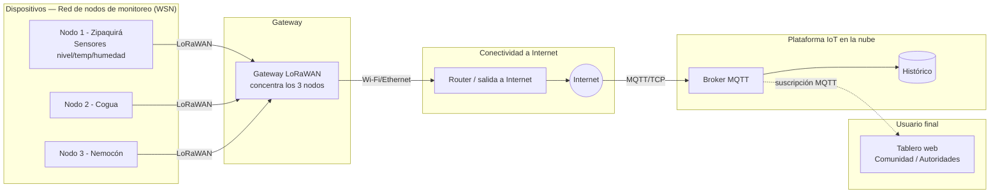
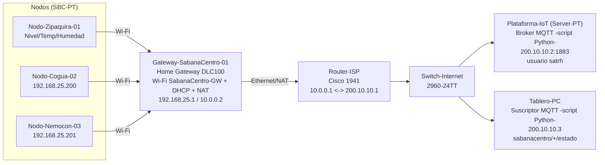

[⬅ Volver al índice](00-Home.md)

# Conectividad en IoT — Red distribuida de monitoreo hídrico (Actividad de refuerzo #2.3)

**Curso:** Internet de las Cosas — 2026-2 — Universidad de La Sabana

**Equipo:** Mateo Ramírez Cabrera · Antonio Benítez Rueda · Jorge Andrés Rodríguez Huertas

**Proyecto base:** Sistema de Alerta Temprana de Riesgo Hídrico

> Esta actividad extiende el prototipo del Challenge #1 (un único nodo ESP32 con alerta local, sin redes de comunicación) hacia una **red distribuida de múltiples nodos de monitoreo hídrico (WSN)** repartidos en distintos puntos críticos de la región Sabana Centro, que ahora sí se comunican mediante **MQTT**, un **gateway** y una **plataforma IoT en la nube**. La restricción "sin redes de comunicación" del Challenge no aplica aquí: el objetivo de este taller es precisamente diseñar y validar esa conectividad de extremo a extremo. El diseño se validó completamente en **Cisco Packet Tracer**.

---

## 1. Descripción del diseño

### 1.1 El proceso, visto como red de nodos

En el Challenge #1, un solo ESP32 medía nivel de agua, temperatura, humedad, presión y radiación solar en **un** reservorio, y decidía su propio estado de riesgo localmente. Al escalar la solución a toda la región Sabana Centro, ya no hablamos de un dispositivo aislado sino de una **red inalámbrica de sensores (WSN)**: cada punto crítico (aljibe, tanque comunitario, distrito de riego) tiene su propio nodo, y todos esos nodos deben reportar sus mediciones — y su clasificación de riesgo local — a un punto central donde la comunidad y las autoridades (CAR, alcaldías, UGRD) puedan monitorear el panorama completo de la región, no solo un punto aislado.

Para esta actividad se implementaron **3 nodos** representando 3 puntos críticos reales de la región: **Zipaquirá, Cogua y Nemocón**.

### 1.2 Tipo de red por segmento

La red completa no es homogénea: tiene dos segmentos con requisitos muy distintos, por lo que el diseño propone una arquitectura **híbrida de dos saltos**.

| Segmento | Tipo de red (diseño ideal para despliegue real) | Justificación |
|---|---|---|
| **Nodo sensor → Gateway local** | LPWAN — **LoRaWAN** | Los puntos críticos de Sabana Centro están dispersos en zona rural, a varios kilómetros entre sí. LoRaWAN ofrece alcance de varios kilómetros en campo abierto y bajísimo consumo energético, ideal para nodos alimentados con batería + panel solar que solo envían unas pocas variables cada cierto intervalo. |
| **Gateway → Plataforma IoT (nube)** | WLAN / Internet — **Wi-Fi o Ethernet** | El gateway puede ubicarse en un punto con mejor infraestructura (sede de la junta de acueducto, alcaldía) con salida a Internet estable. |

> **Nota de implementación en esta simulación:** la versión de Cisco Packet Tracer disponible para el equipo **no incluye dispositivos LoRaWAN** (Gateway/Emitter). Por eso, el enlace nodo→gateway se simuló usando **Wi-Fi a través de un Home Gateway (DLC100)**, que en Packet Tracer cumple un rol equivalente de concentrador inalámbrico de corto alcance con salida a Internet vía NAT. El diseño conceptual recomendado para un despliegue real en campo sigue siendo LoRaWAN por las razones de la tabla anterior; lo que cambió fue únicamente la tecnología radioeléctrica usada **dentro del simulador**, no la arquitectura lógica (nodos → gateway → Internet → plataforma → tablero).

**Comparación de alcance/energía/volumen de datos que sustentó la decisión de diseño:**

| Tecnología considerada | Alcance típico | Consumo energético | Volumen de datos soportado | ¿Elegida? |
|---|---|---|---|---|
| Bluetooth Low Energy (PAN) | ~10-100 m | Muy bajo | Bajo | No — alcance insuficiente para nodos dispersos en el territorio |
| Wi-Fi / 802.11 (WLAN) | ~50-100 m (por AP) | Medio-alto | Alto | No para el enlace nodo→gateway en un despliegue real (exigiría puntos de acceso en zona rural); **sí se usó como sustituto de LoRaWAN dentro de la simulación**, y también para el enlace gateway→router→Internet |
| Zigbee / 802.15.4 (WLAN de baja potencia, malla) | ~10-100 m por salto | Bajo | Bajo-medio | No — alcance por salto sigue corto para las distancias entre puntos críticos de la región |
| **LoRaWAN (LPWAN)** | **2-15 km** (rural) | **Muy bajo** | **Bajo** (ideal para telemetría periódica) | **Sí, en el diseño para campo real** (no disponible en el simulador usado) |
| NB-IoT / LTE-M (LPWAN celular) | Cobertura celular del operador | Bajo | Bajo-medio | Alternativa de respaldo válida si hay cobertura celular en la zona |

### 1.3 Protocolos de red investigados

| Capa | Protocolo | Uso en este diseño |
|---|---|---|
| Enlace/Físico (nodo→gateway, diseño real) | **LoRaWAN** (banda ISM 915 MHz en Colombia) | Transporta los mensajes de los nodos hasta el gateway en un despliegue de campo |
| Enlace/Físico (nodo→gateway, simulado) | **Wi-Fi (802.11)**, SSID `SabanaCentro-GW`, sin autenticación | Sustituto usado dentro de Packet Tracer por no disponer de dispositivos LoRaWAN |
| Enlace/Físico (gateway→router) | **Ethernet (802.3)**, con NAT en el Home Gateway | Conecta el gateway a la red que representa Internet |
| Red/Transporte | **IP / TCP** | Transporte estándar entre el gateway y la plataforma en la nube |
| Aplicación (telemetría) | **MQTT** (sobre TCP, puerto 1883) | Publica las mediciones y el estado de riesgo de cada nodo hacia la plataforma y el tablero |
| Aplicación (alternativa considerada) | CoAP | Descartado: CoAP es más adecuado para modelos petición/respuesta tipo REST sobre UDP; MQTT se ajusta mejor a un modelo de publicación/suscripción many-to-many como el que necesita esta red de múltiples nodos y múltiples observadores |
| Aplicación (visualización) | **HTTP/HTTPS** | Usado por la plataforma IoT y el navegador del usuario final en un despliegue real para mostrar el tablero web |

### 1.4 Por qué MQTT es adecuado para este reto, y cómo se implementó

**MQTT** (Message Queuing Telemetry Transport) es un protocolo de publicación/suscripción diseñado específicamente para redes de sensores con ancho de banda limitado — exactamente el perfil de esta red de nodos hídricos. A diferencia de un modelo petición/respuesta, MQTT permite que **muchos nodos publiquen** y **muchos observadores se suscriban** sin que unos y otros necesiten conocerse directamente; todos pasan por un **broker** central.

**Roles implementados:**

| Rol MQTT | Quién lo cumple en la simulación |
|---|---|
| **Publicador (publisher)** | Cada uno de los 3 nodos (`Nodo-Zipaquira-01`, `Nodo-Cogua-02`, `Nodo-Nemocon-03`), mediante un script Python personalizado (`main.py`, plantilla **MQTT Client**) instalado en cada `SBC-PT` |
| **Broker** | `Plataforma-IoT` (`Server-PT`), corriendo un script Python personalizado (`mqttbroker.py`, plantilla **MQTT Broker**) |
| **Suscriptor (subscriber)** | `Tablero-PC` (`PC-PT`), mediante un script Python personalizado (`mqttclient.py`) suscrito con comodín a `sabanacentro/+/estado` |

> **Nota técnica:** la versión de Packet Tracer usada no expone MQTT como un servicio nativo en la pestaña **Services** del servidor. En su lugar, MQTT se implementa mediante **plantillas de "Global Script Project" en Python** (`MQTT Broker` y `MQTT Client`) que se instalan en el escritorio de cada dispositivo. Esto se descubrió durante la validación (ver sección 2.3) y se documenta aquí porque cambia la forma de configurarlo respecto a lo que se esperaría en versiones más recientes de Packet Tracer.

**Estructura de tópicos implementada** (jerárquica, por región / nodo / variable):

| Tópico | Contenido | Frecuencia |
|---|---|---|
| `sabanacentro/<nodo>/telemetria/nivel` | Lectura cruda del potenciómetro que simula el HC-SR04 (escala 0–1023) | cada 10 s |
| `sabanacentro/<nodo>/telemetria/temperatura` | Lectura cruda del sensor de temperatura (escala 0–1023) | cada 10 s |
| `sabanacentro/<nodo>/telemetria/humedad` | Lectura cruda del sensor de humedad (escala 0–1023) | cada 10 s |
| `sabanacentro/<nodo>/estado` | `NORMAL` / `PRECAUCION` / `CRITICO` (sin tildes, por simplicidad del script) | cada 10 s, y de inmediato ante cualquier cambio |

Donde `<nodo>` es `nodo-zipaquira-01`, `nodo-cogua-02` o `nodo-nemocon-03` (en minúsculas). El `Tablero-PC` se suscribe con el comodín `sabanacentro/+/estado` para ver el estado de los 3 nodos en un solo lugar.

**Clasificación de estado y umbrales usados en la simulación:**

Para esta actividad, el nivel se simuló con un **potenciómetro** (valor crudo 0–1023, sin convertir a porcentaje ni a centímetros como en el firmware real del Challenge, ya que el foco aquí es la conectividad, no la calibración física del sensor):

- `PRECAUCION` cuando el valor ≥ 400.
- `CRITICO` cuando el valor ≥ 700.
- **Histéresis de 50 unidades** para evitar oscilaciones: una vez en `CRITICO`, solo se regresa a `PRECAUCION` cuando el valor baja de 650; una vez en `PRECAUCION`, solo se regresa a `NORMAL` cuando baja de 350.

> Esta histéresis **no estaba en el diseño original** y se agregó durante la validación al detectar que, sin ella, el estado oscilaba de forma inestable cerca del umbral de 700 (ver reto #12 en la sección 2.3) — es una mejora real de diseño que surgió de la propia prueba.

**Calidad de servicio (QoS):** en esta implementación, todos los mensajes se publican con **QoS 0** (como máximo una vez), determinado por el comportamiento por defecto de la plantilla de script de Packet Tracer. Esto es una simplificación válida para la simulación, pero se documenta como limitación: en un despliegue real, se recomienda usar **QoS 1** para el tópico `estado` (para garantizar que una transición a `CRITICO` no se pierda) y dejar QoS 0 solo para la telemetría de alta frecuencia — tal como se planteó en el diseño inicial. Ver sección 2.4 (trabajo futuro).

**Autenticación:** el broker requiere usuario/contraseña (`satrh` / `satrh123`), configurados directamente en el código del broker para que persistieran entre reinicios (ver reto #9).

**Topología de red simulada (direccionamiento IP real):**

| Dispositivo / interfaz | IP | Máscara | Gateway |
|---|---|---|---|
| `Gateway-SabanaCentro-01` — red interna (LAN/Wi-Fi) | `192.168.25.1` | `255.255.255.0` | — |
| `Gateway-SabanaCentro-01` — puerto Internet | `10.0.0.2` | `255.255.255.252` | `10.0.0.1` |
| `Router-ISP` — interfaz G0/0 (hacia el gateway) | `10.0.0.1` | `255.255.255.252` | — |
| `Router-ISP` — interfaz G0/1 (hacia el servidor) | `200.10.10.1` | `255.255.255.0` | — |
| `Plataforma-IoT` (broker MQTT, puerto 1883) | `200.10.10.2` | `255.255.255.0` | `200.10.10.1` |
| `Tablero-PC` | `200.10.10.3` | `255.255.255.0` | `200.10.10.1` |
| `Nodo-Zipaquira-01` | IP dinámica por DHCP del gateway (`192.168.25.x`) | `255.255.255.0` | `192.168.25.1` |
| `Nodo-Cogua-02` | `192.168.25.200` (estática) | `255.255.255.0` | `192.168.25.1` |
| `Nodo-Nemocon-03` | `192.168.25.201` (estática) | `255.255.255.0` | `192.168.25.1` |

El `Gateway-SabanaCentro-01` entrega direcciones por **DHCP** a la red de nodos y hace **NAT** hacia el `Router-ISP`, que en esta simulación cumple el rol de "Internet" (no se usó un dispositivo `Cloud-PT` independiente).

### 1.5 Diagrama del ecosistema IoT

**a) Diseño conceptual para un despliegue real en campo:**



**b) Topología realmente implementada y validada en Packet Tracer:**



**Lectura del diagrama real:** los 3 nodos publican por Wi-Fi hacia el `Home Gateway`, que hace NAT hacia el `Router-ISP` (que representa la salida a Internet). Desde ahí, a través de un switch, tanto el broker MQTT (`Plataforma-IoT`) como el tablero (`Tablero-PC`) quedan en el mismo segmento de red pública simulada. Los nodos publican en sus tópicos de telemetría y estado; el tablero se suscribe con comodín y recibe las actualizaciones de los 3 nodos en tiempo real.

---

## 2. Proceso de validación (Cisco Packet Tracer)

### 2.1 Dispositivos usados

| Dispositivo en Packet Tracer | Nombre asignado | Función |
|---|---|---|
| `SBC-PT` | `Nodo-Zipaquira-01` | Nodo sensor 1 (publicador MQTT) |
| `SBC-PT` | `Nodo-Cogua-02` | Nodo sensor 2 (publicador MQTT) |
| `SBC-PT` | `Nodo-Nemocon-03` | Nodo sensor 3 (publicador MQTT) |
| `Home Gateway` (DLC100) | `Gateway-SabanaCentro-01` | Gateway Wi-Fi + DHCP + NAT de los nodos |
| Router Cisco 1941 | `Router-ISP` | Representa el proveedor de Internet |
| Switch 2960-24TT | `Switch-Internet` | Conecta servidor y PC del lado de la plataforma |
| `Server-PT` | `Plataforma-IoT` | Corre el broker MQTT (script Python) |
| `PC-PT` | `Tablero-PC` | Corre el cliente suscriptor MQTT (script Python) |

Cada nodo tiene 3 sensores conectados a sus puertos digitales: un **potenciómetro** en `D0` (simula el HC-SR04/nivel), un **sensor de temperatura** en `D1`, y un **sensor de humedad** en `D2`.

**Topología completa armada en Packet Tracer:**


### 2.2 Configuración y pruebas realizadas

**Broker MQTT en la Plataforma-IoT:** se instaló el script `mqttbroker.py` (plantilla *Global Script Project → MQTT Broker*), con el servicio activado y el usuario `satrh` precargado:


**Direccionamiento IP estático de la Plataforma-IoT** (`200.10.10.2`, máscara `255.255.255.0`, gateway `200.10.10.1`):


**Nodo publicando telemetría y estado:** el `Nodo-Zipaquira-01` corriendo su script `main.py`, con la consola mostrando publicaciones reales como `Published message '558' to topic 'sabanacentro/nodo-zipaquira-01/telemetria/temperatura'` y `Published message 'CRITICO' to topic 'sabanacentro/nodo-zipaquira-01/estado'`:


**Prueba de conectividad IP (ping):** desde `Nodo-Cogua-02` hacia la `Plataforma-IoT` (`200.10.10.2`), con 4/4 paquetes recibidos y un RTT promedio de 11 ms:


**Tablero recibiendo las actualizaciones de los 3 nodos:** el script suscriptor del `Tablero-PC` mostrando en consola los mensajes recibidos de los 3 nodos en tiempo real, incluyendo el cambio de estado:

```
>>> nodo-cogua-02     | sabanacentro/nodo-cogua-02/estado = NORMAL
>>> nodo-zipaquira-01 | sabanacentro/nodo-zipaquira-01/estado = CRITICO
>>> nodo-nemocon-03   | sabanacentro/nodo-nemocon-03/estado = PRECAUCION
>>> nodo-cogua-02     | sabanacentro/nodo-cogua-02/estado = NORMAL
>>> nodo-zipaquira-01 | sabanacentro/nodo-zipaquira-01/estado = CRITICO
```


Esta captura es la **evidencia central de la validación**: confirma que los 3 nodos, cada uno con su propio estado (`NORMAL`, `CRITICO`, `PRECAUCION`), llegan correctamente y de forma diferenciada hasta un único punto de observación (el tablero), que es exactamente el objetivo de la red distribuida.

### 2.3 Retos enfrentados y solución (troubleshooting real)

Esta tabla documenta, en orden cronológico, los problemas **reales** que el equipo enfrentó al construir y probar la topología — no problemas hipotéticos.

| # | Problema encontrado | Diagnóstico | Solución aplicada |
|---|---|---|---|
| 1 | Un nodo no recibía IP (quedaba con `169.254.x.x`, IP de auto-configuración) | Faltaba agregar el `Home Gateway` al lienzo | Se agregó el `Home Gateway` con SSID `SabanaCentro-GW`; el nodo recibió IP `192.168.25.x` por DHCP |
| 2 | Los sensores parecían estar en puertos equivocados | Se intentó conectar en puertos analógicos, pero el `SBC-PT` **solo tiene puertos digitales** (`D0`-`D9`) | Se conectaron los 3 sensores en `D0`, `D1`, `D2` y se validó con `analogRead()` que sí entregaba valores 0–1023 |
| 3 | El `ping` desde el `Tablero-PC` hacia el gateway (`10.0.0.2`) fallaba | El `Home Gateway` hace NAT y, como un router doméstico real, no responde pings originados desde fuera de su red | Se validó la conectividad de otra forma: `ping` desde un nodo hacia el servidor, que sí respondió correctamente |
| 4 | El `Server-PT` no tenía pestaña de servicio MQTT nativo | Esta versión de Packet Tracer implementa MQTT mediante **plantillas de script Python** (`Global Script Project`), no como servicio de la pestaña *Services* | Se creó un proyecto `MQTT Broker (Python)`, se instaló en el escritorio del servidor y se creó el usuario `satrh` |
| 5 | Un nodo se configuró con la plantilla equivocada | Se detectó que el proyecto del nodo tenía el archivo `mqttbroker.py` en vez de un cliente | Se borró el proyecto y se recreó con la plantilla correcta `MQTT Client (Python)` |
| 6 | La app gráfica *MQTT Client* del `Tablero-PC` no mostraba campo de suscripción | Se conectaba al broker (`CONNACK` código 0 en el log), pero la interfaz gráfica no exponía la opción de suscribirse a tópicos | Se escribió un script Python propio (`mqttclient.py`) que se conecta, se suscribe a `sabanacentro/+/estado` y muestra los mensajes por consola |
| 7 | El suscriptor no conectaba (`Connection change type: 4`) | La app gráfica del *MQTT Client* seguía corriendo en paralelo en el mismo PC, compitiendo por la conexión | Se detuvo la app gráfica y se dejó un único cliente activo por dispositivo |
| 8 | El broker se caía con error `dict changed size during iteration` | Error en la plantilla de Packet Tracer: al desconectarse un cliente, el broker lo borraba de una lista mientras la recorría | Se corrigió el código `mqttbroker.py`; además se cambió la reconexión de los clientes para reintentar de a uno (los reintentos cada 3 s saturaban el broker) |
| 9 | El usuario del broker se perdía al reiniciar el servicio | Cada reinicio del broker borraba la lista de usuarios autorizados, y los clientes quedaban rechazados | Se dejó el usuario `satrh` precargado directamente en el código del broker, en vez de agregarlo manualmente cada vez |
| 10 | El broker volvía a caerse (`IPC Call ERROR: object does not exist`) al conectar el tercer nodo | El broker intentaba responder a un cliente que ya se había desconectado | Se protegieron los envíos del broker con manejo de errores, para descartar ese cliente sin detener el servicio completo |
| 11 | El suscriptor no reconectaba: error `Username cannot be empty while password is non-empty`, pese a enviarlos correctamente | La librería `mqttclient.py` validaba los datos guardados de un intento de conexión anterior, no los nuevos | Se corrigió esa validación en la librería, tanto en el `Tablero-PC` como en los 3 nodos |
| 12 | El estado oscilaba entre `PRECAUCION` y `CRITICO` sin parar cuando el valor rondaba 700 | No había histéresis: el sistema evaluaba el umbral exacto en cada ciclo | Se agregó una histéresis de 50 unidades (entra a `CRITICO` en 700, solo sale al bajar de 650) |
| 13 | Los nodos copiados (`Cogua` y `Nemocón`) no recibían IP por DHCP, aunque estaban correctamente asociados al Wi-Fi | Causa no determinada con certeza (posible límite/bug del DHCP del `Home Gateway` con múltiples clientes copiados) | Se asignaron IPs estáticas (`192.168.25.200` y `192.168.25.201`) con gateway `192.168.25.1`, y se confirmó la conectividad con `ping` al servidor |

**Captura del error del broker (reto #8/#10)**, mostrando el script `mqttbroker.py` y el mensaje `ExternalError: IPC Call ERROR: object does not exist or already deleted on line 236`:


**Interfaz gráfica de MQTT Client** del `Tablero-PC` que motivó reemplazarla por un script propio (reto #6):


### 2.4 Diferencias entre el diseño inicial y lo finalmente validado

Es importante documentar honestamente qué cambió entre el diseño conceptual (sección 1) y lo que realmente se construyó y probó, porque esa diferencia es parte del aprendizaje de la actividad:

| Aspecto | Diseño inicial | Implementado y validado |
|---|---|---|
| Enlace nodo→gateway | LoRaWAN | Wi-Fi (por no disponer de dispositivos LoRaWAN en esta versión de Packet Tracer) |
| Servicio MQTT del broker | Servicio nativo del servidor | Script Python personalizado (plantilla `MQTT Broker`) |
| Tópicos de análisis (`vpd`, `indice_evaporativo`, `tasa_descenso`, `riesgo_hidrico`) | Planeados en el diseño | No implementados en esta iteración; solo se validó `telemetria/*` y `estado`. Queda como trabajo futuro extender los nodos para publicar también las variables de análisis fusionado, replicando la lógica del firmware del Challenge |
| QoS | QoS 1 para `estado`, QoS 0 para telemetría | QoS 0 para todos los tópicos (limitación de la plantilla usada) |
| Valores de nivel/temperatura/humedad | Unidades físicas (%, °C) como en el Challenge | Valores crudos de potenciómetro/sensor (escala 0–1023), suficiente para validar conectividad pero no calibrado físicamente |
| Histéresis de estado | No contemplada explícitamente | Agregada durante la validación al detectar oscilación de estado (reto #12) |

---

## 3. Referencias

[1] OASIS, "MQTT Version 5.0 — OASIS Standard," mar. 2019. [En línea]. Disponible: https://docs.oasis-open.org/mqtt/mqtt/v5.0/mqtt-v5.0.html

[2] LoRa Alliance, "LoRaWAN L2 1.0.4 Specification," 2020. [En línea]. Disponible: https://lora-alliance.org/resource_hub/lorawan-specification-v1-0-4/

[3] IEEE Standards Association, "IEEE 802.11-2020 — Wireless LAN Medium Access Control (MAC) and Physical Layer (PHY) Specifications," 2020.

[4] Cisco Networking Academy, "Packet Tracer — IoT: Configuring MQTT," documentación oficial del curso *Introduction to IoT / IoT Fundamentals: Connecting Things*, Cisco Systems, 2024.

[5] Comisión de Regulación de Comunicaciones (CRC), "Cuadro Nacional de Atribución de Bandas de Frecuencias (CNABF) — Banda ISM 902-928 MHz," Colombia, 2023. [En línea]. Disponible: https://www.crcom.gov.co/

[6] Z. Shelby, K. Hartke y C. Bormann, "The Constrained Application Protocol (CoAP)," RFC 7252, IETF, jun. 2014. [En línea]. Disponible: https://datatracker.ietf.org/doc/html/rfc7252


---
[⬅ Volver al índice](00-Home.md)
